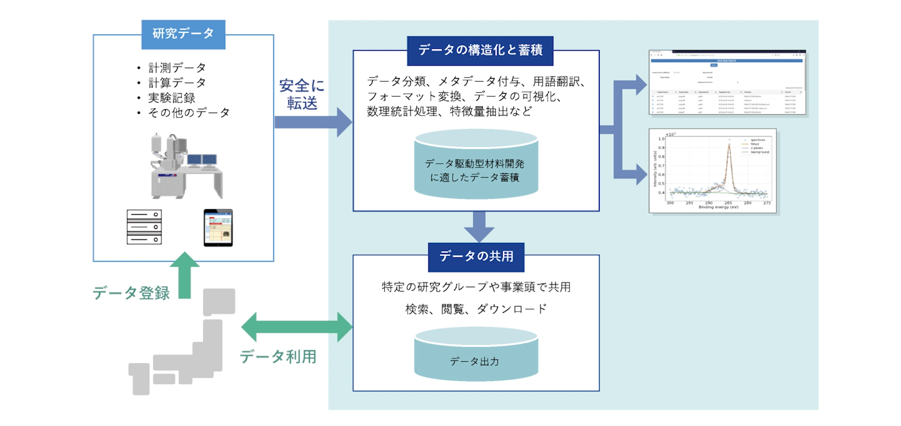
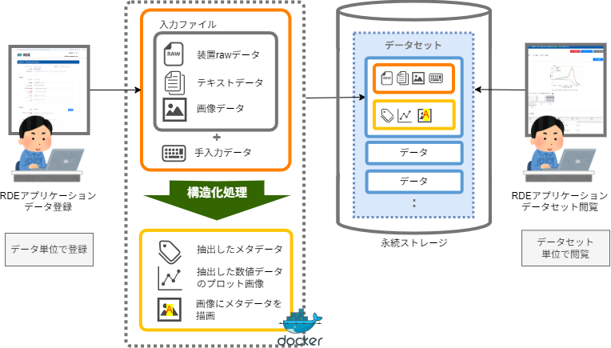

# 本書について

本書は、これからRDEデータセットテンプレートの開発を始める人に、最初に読んでいただくことを目的とした資料です。 
**RDE**って何？ **データセット**？ **テンプレート**？と聞いたことはあるが分からないRDEの用語が次々と出ててきますが、それらの用語をざっくりと紹介しつつRDEの特徴であるデータセットテンプレートについて説明を試みています。本書ですべてを詳細に説明しようとはしていません。他の更に詳細な技術的資料を読む前の準備運動だと思ってください。

# RDEとは

## RDE

RDE (Research Data Express) は、**物質・材料についての研究データをオンラインで迅速に登録するためにNIMSが開発したシステム**です。測定データなどを登録すると自動的にデータ駆動型のマテリアル研究に適した形に`構造化`してクラウドに蓄積します。これによりユーザーや研究グループ内での再利用や他の研究グループとのデータの共用が容易となり、マテリアル研究開発のDX化を支援します。Figure1 にRDEの概要を示します。

Figure1 RDEの概要

RDEの概要についてはホームページを参照してください。

## データセット・データ

RDEは実験装置から出力されたデータファイルや計算結果を登録するためのデータベースです。そのためこれらのデータファイル(データと呼ぶことのほうが多い)を入れる箱を用意する必要があります。RDEではこの箱を`データセット`と呼んでいます。データセットの中には複数のデータを保存することができます。データセットは同じ構造（測定データなど、メタデータ、送り状、サムネイル画像、**構造化**データなど）を持ったデータの入れ物です。一つのデータが一つの試料に相当するのが標準的な使い方です。

## データ構造化

RDEの特徴として、`データ構造化`が挙げられます。データ構造化とは、データ分類、メタデータ付与、用語翻訳、フォーマット変換、数値データの可視化や数理統計、特徴量抽出などの処理のことで、マテリアルズ・インフォマティクス（MI）によるデータ駆動型の材料研究に適した形でデータを蓄積するために必要な処理です。RDEではデータ登録時に`構造化処理`を実行する機能が用意されています。また構造化処理はデータセットごとに異なるものを適用することができます。これを実現するためのしくみが**データセットテンプレート**です。 Figure2 は、データ構造化と蓄積処理フローのイメージです。

Figure2 データ構造化と蓄積の流れ

