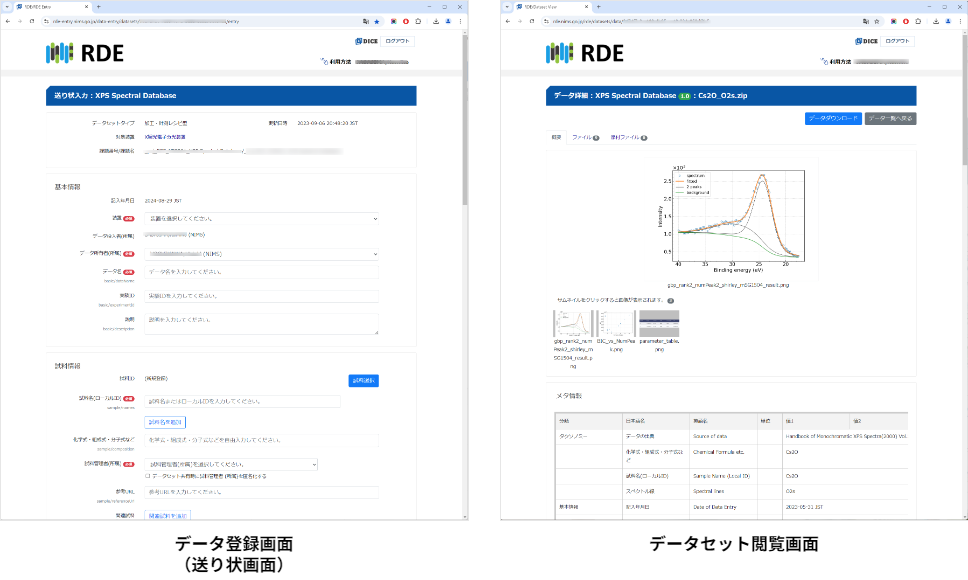

# データ登録方法

## RDEアプリケーション
RDEへのデータの登録や閲覧は、**RDEアプリケーション**で行います。データ登録には**RDEデータ登録アプリケーション**、データセット・データの閲覧などには**RDEデータセット閲覧アプリケーション**をそれぞれ利用します。いずれのRDEアプリケーションもChromeなどのWebブラウザ上で動作するWebアプリケーションです。使用にはDICEサービスでアカウントを作成(サインアップ)し、利用申請をする必要があります。 
登録、閲覧画面は**データセット**ごとにカスタマイズすることができます。それを実現するしくみが`データセットテンプレート`です。構造化処理で抽出したメタデータやグラフなどの画像を指定できます。Figure3 に表示例を示します。

Figure3 RDEアプリケーション

RDEの概要についてはホームページを参照してください。

!!! Hint "データ登録画面の名称"

    RDEアプリケーションのデータ登録画面は、`送り状画面`、`入力フォーム`と表現する場合があります。

## 一括登録など

RDEアプリケーションでは１つの送り状につき1つのデータの登録が基本です。ただし、データセットテンプレートには、まとめて複数のデータを登録したい場合はエクセルインボイス機能を使うと1回の送り状で複数のデータを登録できる機能を持ったものが用意されています。

データセットテンプレートには、あらかじめ構造化したファイルを登録する、XRD、電子顕微鏡の測定データを登録するなどあらかじめ用意されたものもあります。RDEはデータセットテンプレートの種類を増やすことで多くの測定データなどを登録できるという拡張性があります。

### エクセルインボイス

エクセルインボイスは、入力情報を記入した既定のエクセルファイルと複数のデータファイルをまとめてzip形式のファイルをまとめて登録することで、複数のデータとして登録するための機能です。

