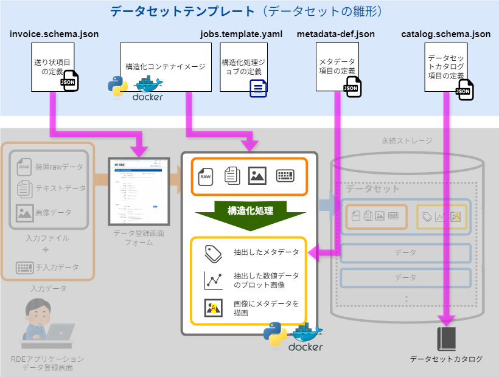
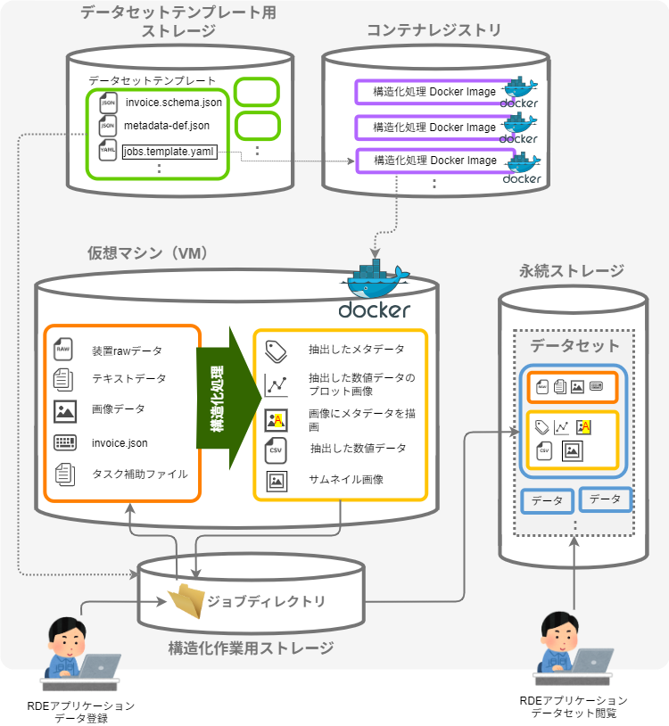
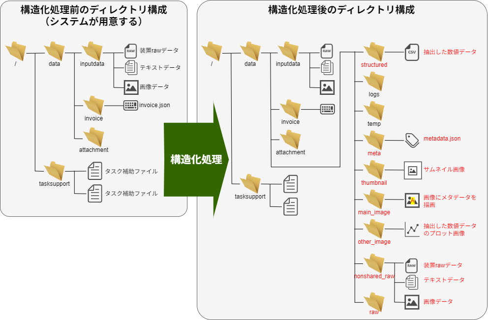
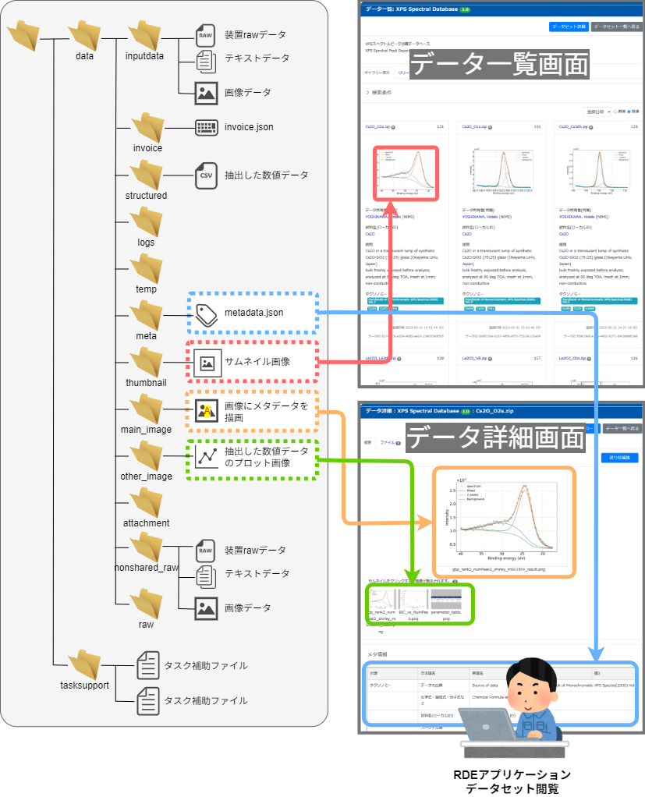

# データセットテンプレートの開発

RDEでは[開発者向けの資料やツール](#)を複数用意しています。ここでは、それらに触れる前の基礎知識の習得とイメージの共有をします。


## データセットテンプレートの構成要素

データセットテンプレートは、いくつかの定義ファイル（以下「テンプレートファイル」と呼びます）と、構造化処理用Docker Imageで構成されています。データセットテンプレート開発者はこれらのテンプレートファイルおよびDocker Imageを作成します。以下の表にデータセットテンプレートを構成する定義ファイルなどを示します。

|ファイル名前|内容|
|--|--|
|（構造化処理用 Docker Image）|構造化コンテナイメージ<br>`python`で記述された構造化処理をDockerコンテナ化したもの|
|invoice.schema.json|送り状入力画面の設定ファイル<br>送り状画面の入力項目を、表示名、表示順、必須項目などを含め指定できます。手入力項目を定義するときに利用します。|
|metadata-def.json|抽出するメタデータの定義ファイル。構造化処理で抽出したメタデータの定義。|
|catalog.schema.json|データカタログ定義ファイル|
|batch.yaml|データ構造化定義ファイル|
|jobs.template.yaml|データ構造化ジョブ定義ファイル|
|jobs-divided.template.yaml|分割後の個々のデータに適用するデータ構造化ジョブ定義ファイル|
|tasksupport/*|タスク補助ファイル<br>tasksupportディレクトリに格納された、構造化コンテナイメージが実行時に使用するファイル群|

上記のうち、データセットテンプレート開発者が用意するものは、invoice.schema.json、metadata-def.json、catalog.schema.json、tasksupportファイル、構造化処理プログラムです。その他の定義ファイルやDockerコンテナイメージは、データセットテンプレート登録担当者が用意します。ただし、既存のテンプレートを流用する場合は一部の定義ファイルのみであったり、またはコンテナイメージの作成をお願いすることもあります。

Figure5 は、データセットとデータセットテンプレートのイメージ図です。
<center></center>
<center>Figure5 データセットとデータセットテンプレートの関係</center>

<div class="page"/>

## こんなとき何を編集する？

データセットテンプレートを作成するとき、まずは使えそうなものがないか調べてください。これから作りたいものに近いテンプレートを選んで改変して使うことをお勧めします。

予め用意されたデータセットテンプレートを改変して使用する場合（[3章 データセットテンプレートの選択](##データセットテンプレートの選択)参照）、改変したい内容によって編集するファイルが異なります。主に改変するのは`invoice.schema.json`、`metadata-def.json`、`構造化コンテナイメージ`の３つです。なお、構造化コンテナイメージを変更する場合は、DockerとPythonについてある程度の知識が必要です。以下に改変例とそれによって編集すべきテンプレートファイルを示します。

|改変内容|invoice<br>.schema<br>.json|metadata-def<br>.json|構造化<br>コンテナ<br>イメージ|
|:--|:--:|:--:|:--:|
|データ登録画面の入力項目の項目名を変更したい|✓|||
|データ登録画面の入力項目を増やしたい|✓|||
|データ登録画面の入力項目を増やして、メタデータとして登録したい|✓|✓||
|入力ファイルの形式を制限したい|||✓|
|測定データなどから作成するプロットを増やしたい|||✓|
|測定データなどから作成するプロットのタイトルをデータ登録画面で指定したい|✓||✓|
|データセット閲覧画面で表示するデータごとのメイン画像を変更したい|||✓|
|測定データなどから抽出するメタデータを増やしたい||✓|✓|
|メタデータの抽出方法を変更したい|||✓|
|データ登録画面にデータ種別選択項目を追加して、入力値によってメタデータの抽出方法とプロットデータ、プロット書式を変更したい|✓||✓|

<div class="page"/>

## 構造化処理

構造化処理が行なっていることを具体的に説明します。

構造化処理では、構造化作業用ストレージに格納されたデータを使用します。構造化作業用ストレージには`ジョブディレクトリ`と呼ばれる定型の構造をもつディレクトリがあり、RDEアプリケーションからデータの登録を行うと、まずジョブディレクトリに入力ファイルや手入力データが格納されます。次に構造化処理を行うpythonファイルが起動され、ジョブディレクトリに格納されたデータを用いて構造化ファイルを作成します。構造化ファイルはジョブディレクトリの決められた場所に格納します。<br>
RDEの構造化処理を大胆に要約すれば、RDEの定義に従ったファイルをジョブディレクトリに作成することです。RDEのデータ登録では、ジョブディレクトリに配置されたファイルをシステムに登録します。<br>
Figure6 は、データセットと各種ストレージの構成図です。<br>

<center></center>
<center>Figure6 データセットと各種ストレージの構成図</center>


<div class="page"/>

### ジョブディレクトリ
ジョブディレクトリは定型の構造を持っています。以下にディレクトリ構造と格納されるファイルを示します。
```
/
├── structured           データ構造化用jobs.yamlファイル
├── shipyardyaml         ジョブ設定ファイル
├── data
│   ├── invoice          送り状ファイル（invoice.json）
│   ├── invoice_patch    送り状ファイル修正パッチ
│   ├── inputdata        入力されたrawファイル
│   ├── logs             タスクで生成されるログファイル
│   ├── temp             タスクで生成される中間ファイル
│   ├── meta             蓄積するメタデータファイル（metadata.json）
│   ├── thumbnail        サムネイル画像
│   ├── main_image       メイン画像
│   ├── other_image      メイン画像以外の画像ファイル
│   ├── attachment       添付ファイルとして入力されたファイル
│   ├── nonshared_raw    非共有データ
│   └── raw              共有データ
└── tasksupport          タスク補助ファイル
```
#### 構造化処理での役割
一部のディレクトリは、構造化処理前にRDEシステムによって作成され、RDEアプリケーションから投入されたデータ、さらに、データセットテンプレートに登録されているタスク補助ファイルが格納されています。構造化処理ではそれらのファイルを読み込み、可読化、可視化、メタデータの抽出などを行い、作成したファイルを決められたディレクトリに格納します。さらに、一部のファイルはファイル名も決められています。Figure7 に構造化処理のジョブディレクトリの例を示します。図中の赤字のディレクトリとファイルは、構造化処理によって作成されたものです。

<center></center>
<center>Figure7 構造化処理のジョブディレクトリ</center>

<div class="page"/>


### ジョブディレクトリとRDEアプリケーションでの表示
特定のジョブディレクトリに格納したファイルは、RDEアプリケーションでのFigure8 のように表示されます。

<center></center>
<center>Figure8 ジョブディレクトリとRDEアプリケーションでの表示</center>


<div class="page"/>


