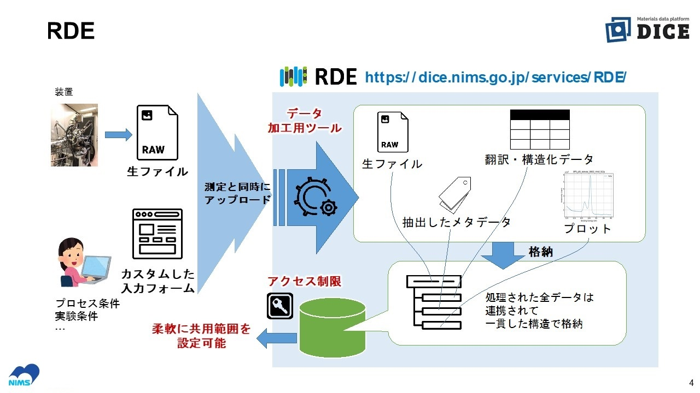

# RDEのデータ登録の概要
　RDEの目的は構造化されたデータの収集であり、データを構造化することで得られたメタデータは機械学習などの特徴量項目などに利用することを想定しています。それを実現する方法として**データセットテンプレート**を用いたデータ種類ごとの処理をシステムに随時追加できるしくみを採用しました。実験結果などから得られた装置出力のデータファイルは装置や実験手法などにより様々な種類があり、それぞれに対応した構造化処理プログラムが必要となります。RDEが様々な登録データを受け入れるためには多様な**データセットテンプレート**が必要となり、特に構造化処理プログラムがその要となります。

下図はRDEにおけるデータ登録の概要を示したものです。

本書ではデータ登録の要となる**データセットテンプレート**とそれを構成する各種ファイル、構造化処理プログラムで出力すべきファイルなどについて説明します。なお構造化処理プログラムの開発手順、詳細については開発者向け資料を参照してください。

# RDEデータセットテンプレート開発環境

RDEデータセットテンプレートの実行環境および技能要件は以下のとおりです。

**RDEデータセットテンプレート開発環境**

2024/8/16 時点

**実行環境などは更新される場合があるため、提供資料がどの時点のシステムを対象にしたものか確認をしてください**

1. RDE構造化処理用pythonパッケージ
    - RDEToolKit v.1.0.0
    - 対応pythonバージョン v.3.11
    - https://pydigger.com/pypi/rdetoolkit
    - install: pip install rdetoolkit
2. 主たる開発言語
    - python v.3.11
    - RDEToolKitの利用を推奨
3. Dockerおよびコンテナ
    - RDEシステム上での処理実行はDockerコンテナによる
    - RDEシステムの構造化処理ホストのdocker環境は以下の通り
        - ホストOS : ubuntuserver20.04-lts:latest(updateはAzureが随時実行)
        - Docker version 20.10.24, build 297e128
        - CPUアーキテクチャ　x86-64 (linux/amd64, linux/i386)
    - pythonを用いるコンテナを作る場合のbaseはpython:3.11-bookwormを基本とする
4. データセットテンプレート作成ツール
    - テンプレート生成ツール
      - 対象エクセルバージョン Microsoft Excel for Microsft 365動作検証済み
      - 生成ツールはpythonで作成、WindowsおよびMacで実行可
    - テンプレート編集ツール VScode Extentionで提供
5. 構造化処理ホスト
    - vcpu : 4
    - vmem : 16GB
    - 構造化処理使用可能ディスク総量 : 10GB
    - 上記仕様のVMを標準で2台構成
6. 構造化処理バッチジョブ管理ツール
    - Azure Batch Shipyard

現状のAzureリソースなど情報反映済み(5/27) 
2025/4までにホストOSはUbuntu 22.*に変更予定 

# 付録
- 付録の章参照
- 本資料で掲載したテンプレートファイルなど、下記のものを提供しています
- rde-datasettemplate-instructions_appendix.zipファイルを取得、展開してご利用ください

