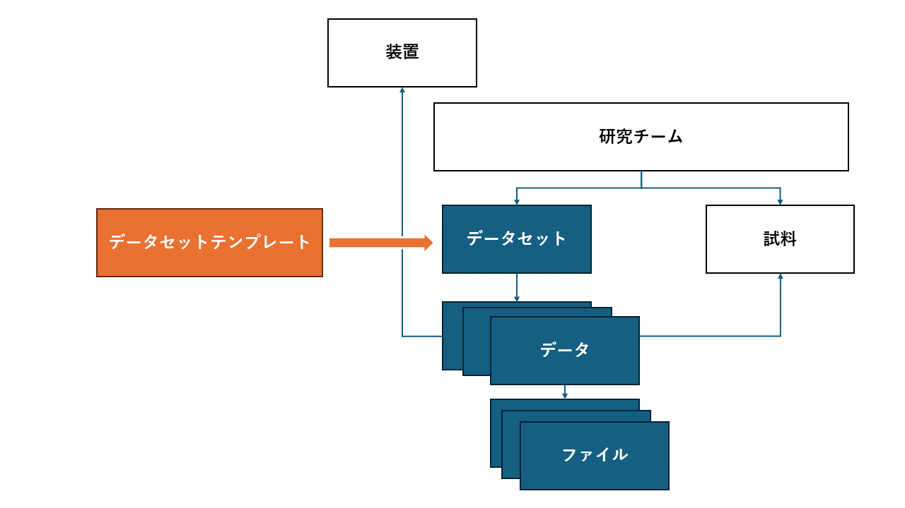

# RDEを構成するオブジェクト

　RDEは研究活動における測定装置出力のデータファイルなど登録するために開発されたデータベースシステムです。特徴としてはデータ登録の過程でデータ固有の処理を実行し機械学習などで利用できるメタデータを抽出・保存することができる仕組みが用意されています。 
　研究チームが測定装置から得られたデータを、データ種類ごとにデータを登録する過程を想定したオブジェクトで構成されています。データはある装置である試料に対する測定をした結果得られるものとしてモデル化されています。以下の図はRDEを構成するオブジェクトの関係を示したものです。

　登録データのアクセス権を管理する単位として**研究チーム**が用意されています。データの登録先となる**データセット**は研究チームの下に複数開設することができます。登録したデータは**データセット**内に**データ**として登録されます(データを一般的用語と区別するため**データタイル**と呼ぶことがあります)。**データ**には測定した**装置**、**試料**を連携することができます。**試料**は**研究チーム**の元で管理されるため、研究チーム内の複数のデータに割り当てることができます。**データ**は複数のファイルで構成されます。 
　RDEの特徴としてデータを登録した時点で**データ構造化処理**と呼ばれるプログラムを実行してメタデータの抽出などを行える機能があります。また、データセットごとに入力項目を変えることができます。取り扱い項目の定義ファイルやDockerコンテナイメージで構成された**データセットテンプレート**を用意することで多様なデータ種別に対応したデータセットを開設することができるようになっています。 
　本書では、**データセットテンプレート**を開発するために必要なRDEシステムの用語、機能などを説明します。

