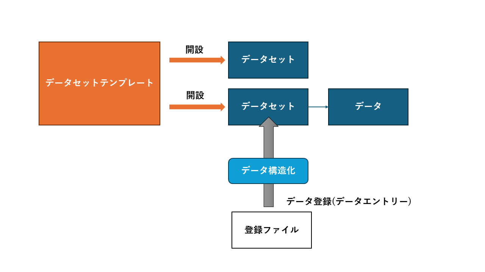
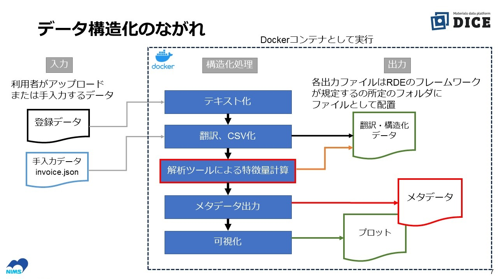
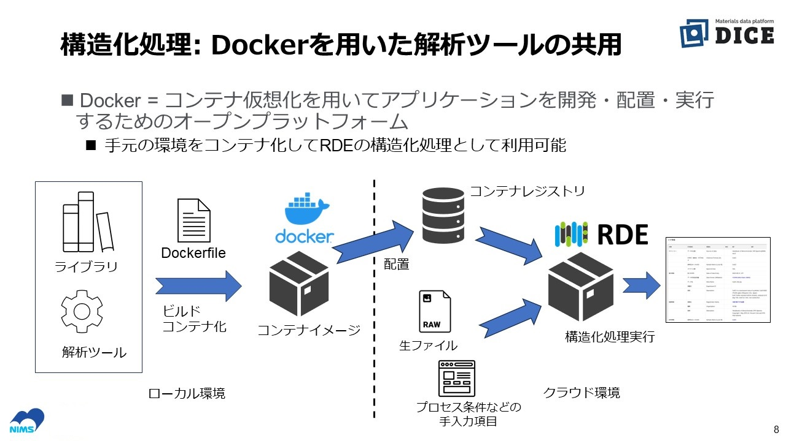
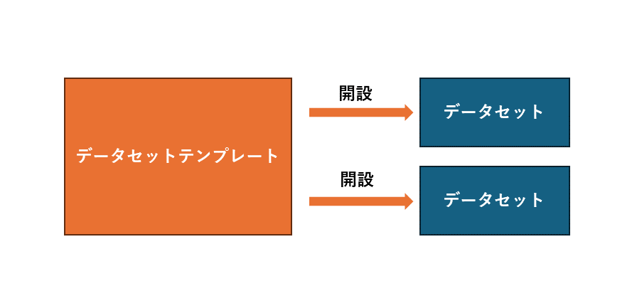
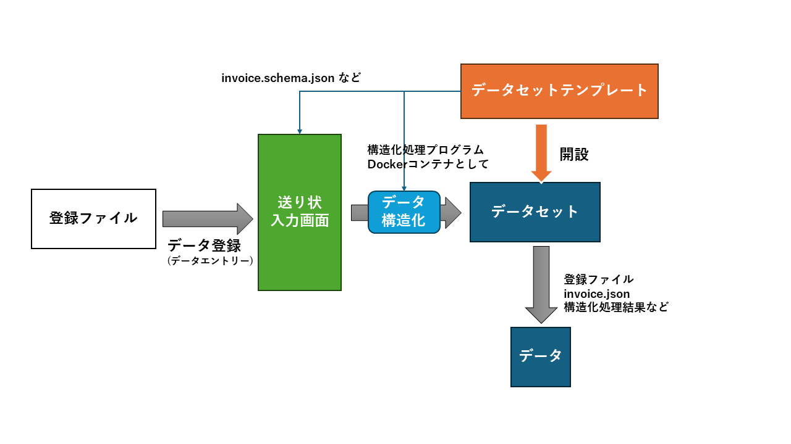
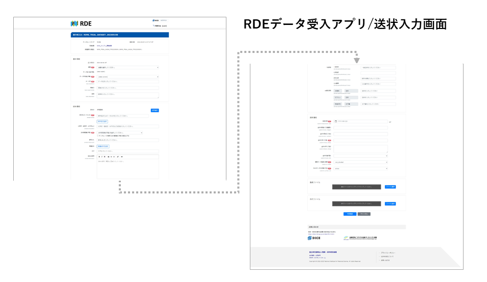
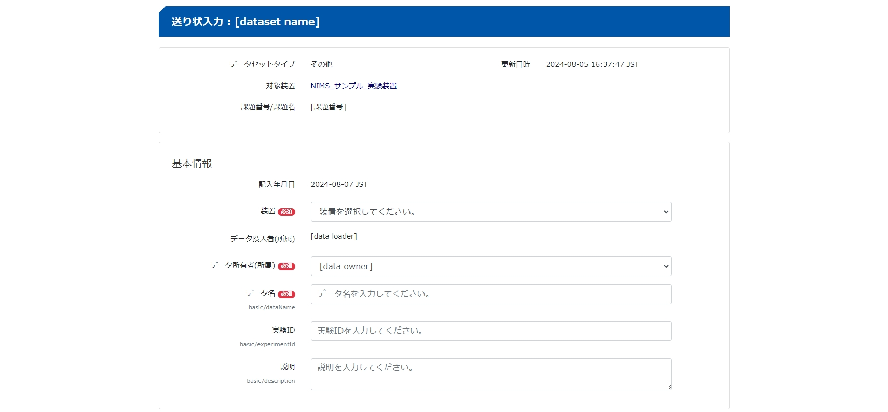
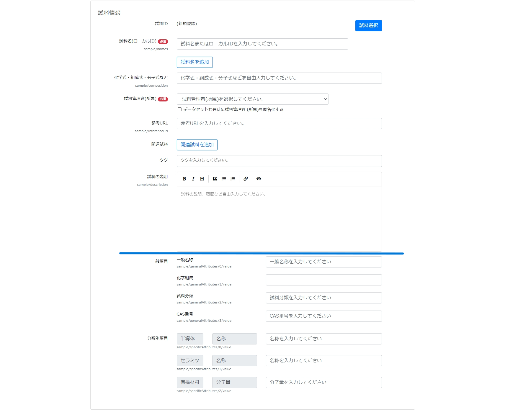
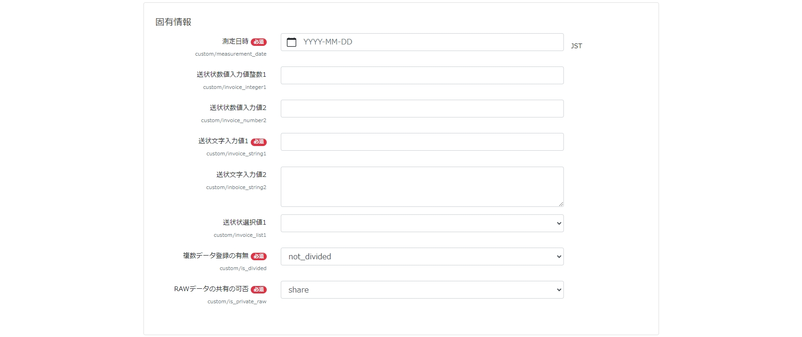
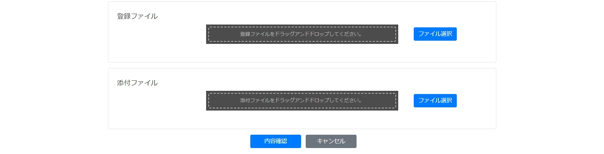

# RDEのデータ登録とデータ構造化処理のしくみ

　RDEは予め用意したデータセットにデータを登録するという方式を採用しています。データセットはデータセットテンプレートを元に作られます(これをデータセットの開設と呼んでいます)。<br>

下図はRDEにおけるデータ登録の概要を示した図です。データセットテンプレートからデータセットを開設、その後データ登録時にデータ構造化を経てデータセットにデータとして登録されることを示しています。


下図はデータ構造化の部分をもう少し詳細に示しています。典型的な構造化処理はこの図のような処理を行っています。



また、本書では詳細は説明RDEの構造化処理はコンテナ技術を利用しており、構造化処理プログラムはDockerコンテナとしてシステムに登録しておき、随時利用する方式としています。この方式のため、システムに随時構造化処理を登録、更新することが可能となっています。なお、DockerコンテナはRDEでは**データセットテンプレート**の構成要素となります。



　**データセット**は**データセットテンプレート**というひな形(テンプレート)を使って開設されます。データセットテンプレートは、装置出力のデータ型式などに合わせて作成されたもので、登録するデータファイルを構造化処理プログラムやその他登録する情報を定義したファイルで構成されています。登録するデータファイルは様々な形式が想定されますが、登録する対象に合わせてデータセットテンプレートを用意しておくことで様々なデータを取り込むことができるようになっています。RDEに取り込めるデータファイルの多様性はデータセットテンプレートの種類を増やすことで実現することができます。<br>
　また、RDEでは登録データから抽出、または手入力の情報をメタデータとして登録する機能があります。メタデータは機械学習のための特徴量や検索のために用いられることを想定しています。この登録データからメタデータや数値データを取り出す処理をRDEでは**データ構造化処理**と呼んでいます。データ構造化処理はデータセットテンプレートを構成する要素として重要な役割を担うものです。

## データセットとデータセットテンプレート



　データセットは1つのデータセットテンプレートから開設されるため、そのデータセットテンプレートがデータ構造化処理可能な同種のデータを登録する入れ物となります。例えば、ある装置からの出力結果を研究プロジェクトごとに登録したい場合は、装置出力に対応したデータセットテンプレートを使って研究プロジェクトごとにデータセットを開設して利用します。<br>

　なお、データセットテンプレートは以下のファイル(テンプレートファイルと呼ぶ)などで構成されます。
- json型式の種々の定義ファイル<br>
- yaml型式の構造化処理バッチ処理の記述ファイル
- データ構造化処理プログラムと動作環境を含むdocker container image

　　データセットテンプレートの開発は、これらの構成要素を作成することになります。

## テンプレートファイルの役割

　テンプレートファイルと用途などは次の通りです。

| テンプレートファイル | 必須 | 生成ファイル | 用途など |
| --- | --- | --- | --- | 
| invoice.schema.json | 必須 | invoice.json | 送状スキーマ。データ受入の生成に利用される。また、invoice.jsonのヴァリデーションに利用される。ただし、invoice.schema.jsonはinvoice.jsonの全項目を網羅していない。構造化処理プログラムでも利用。 |
| metadata-def.json | 必須 | metadata.json | メタデータ定義。metadata.jsonの項目ごとの定義に利用される。JSONスキーマではないためバリデーションには利用できない。構造化処理プログラムでも利用。RDEToolKitはmetadata-def.jsonからmetadata.jsonを生成することができる。|
| catalog.schema.json | 必須 | catalog.json | カタログスキーマ。データセット詳細のカタログ画面に利用される |
| jobs.template.yaml | 必須 | - | バッチ定義。構造化処理バッチの処理内容を記述する |
| batch.yaml | - | - | データ構造化定義(既定のpool以外を利用する場合などに利用) |
| タスク補助ファイル(tasksupport) | - | - | 構造化処理で利用する上記以外のファイル |
| Dockerコンテナイメージ| - | - | 構造化処理プログラムと実行環境 |

上記で一覧したテンプレートファイルはファイル名が固定されているため名前は変更することができません。ただし、tasksupportフォルダ以下に置く補助的ファイルのファイル名は任意です。<br>
また、これらのデータセットテンプレートを開発する場合は開発しようとしているものと類似のものをサンプルとして提供する予定です。

### データセットへのデータ登録と送状(invoice)

　データセットにデータを登録すると、そのデータセットの開設に利用されたデータセットテンプレートによる構造化処理結果がRDEに保存されます。この保存することを**永続化**と呼ぶことがあります。<br>
　データを登録する際はそのデータに関する諸情報を入力するための**送状入力**画面を利用します。送状入力画面は登録先データセットの元となったデータセットテンプレートで定義されたものが利用されます。そのためデータセットごとに(正確にはデータセットテンプレートごとに)に入力項目を変えることができます。<br>



　送状入力項目は、システムが用意したデータの基本情報、試料情報(任意)に加え個別に定義した手入力情報を定義することができます。これは登録データから抽出できないメタデータやラボノートの項目を手入力で登録する場合を想定した機能です。なお、RDEでは、送状を**invoice**と呼ぶこともあります。

**送状入力画面全体**

RDEデータ受入アプリにおける送状入力画面は下図のような入力画面です。この事例は送状項目の基本、試料(基本+カスタム)、固有情報のすべてを定義したものです。このような画面はinvoice.schema.jsonで定義することができます。


<div class="page" />


以下に送状入力画面を情報項目別に紹介します。

#### 基本情報

- データ名、データ所有者などの入力欄
- システムが追加する必須項目
- invoice.schema.jsonで定義せずに出力される項目
- invoice.jsonではbasic要素として出力される

**基本情報の表示例**



#### 試料情報

- 試料情報の入力欄
- 選択で利用できる項目
- 新規の試料入力、登録済み試料の選択を行う
- invoice.schema.jsonではsample要素で定義される項目
- invoice.jsonではsample要素として出力される
- 表示例の青線から上が試料基本項目、下側が追加項目

**試料情報の表示例**



#### 固有情報
- 固有情報の入力欄
- 選択で利用できる項目
- 手入力のメタデータを入力するときに利用
- invoice.schema.jsonではcustom要素で定義される項目
- invoice.jsonではcustom要素として出力される

**固有情報の表示例**



#### 登録・添付ファイル

- 登録ファイル、添付ファイルを選択して仮登録する
- ファイルを仮登録後、[内容確認]、[登録開始]を実行することでデータ登録が開始される

**ファイル選択の表示例**




## データのダウンロード

　ここでデータをダウンロードしたときに取得できるファイルについて説明をしておきます。ダウンロード結果のファイル構造はデータ構造化処理の出力を反映したものとなっています。

　RDEのデータセットに登録されたデータは、データセットまたはデータ単位でダウンロードすることができます(ユーザの権限により閲覧などの範囲は異なります)。ダウンロードはzipファイル形式のファイルで、登録データやデータ構造化処理の結果などのファイルが含まれています。

　以下にデータをダウンロードしたときの実例を示します。ダウンロードで得られたzipファイルを解凍しtreeコマンドで内包するフォルダ、ファイルを示します。
```console
$ unzip data_20240709113208.zip
　出力は略
$ tree dataset_415dd76f-82a9-4a5e-94d0-198928e3f112/
dataset_415dd76f-82a9-4a5e-94d0-198928e3f112/
├── catalog.json
├── catalog.schema.json
├── data_0011
│   ├── data.json
│   ├── filemeta.json
│   ├── invoice.json
│   ├── main_image
│   │   └── all_series.png
│   ├── meta
│   │   └── metadata.json
│   ├── other_image
│   │   ├── series1.png
│   │   └── series2.png
│   ├── raw
│   │   └── sample.data
│   └── structured
│     ├── series1.csv
│     └── series2.csv
├── invoice.schema.json
└── metadata-def.json

6 directories, 14 files
```

- RDEのデータはデータセットに紐づいているため、ダウンロード結果にはデータセットの情報と個々のデータのファイルなどが含まれています
- また、出力されたjsonファイルを読み解くための情報としてデータセットテンプレートの構成ファイルの一部が出力されます
- ダウンロードしたzipファイルを解凍するとdataset_[データセットID]のフォルダがあり、その下にデータのファイルが出力されます(このファイル階層はデータセット一括ダウンロードとデータダウンロードで同一です)
- データはdata_[データ番号(4桁数字)]のフォルダに出力されます
- RDEformat(後述)にはthumbnailフォルダおよびサムネイルファイルが含まれますがダウンロード結果には出力されません
- この出力例では表示されていませんが、添付ファイルがある場合はattachmentフォルダに出力されます

以下に、ダウンロード時に必ず出力される固有のファイルを示します。

| ファイル | フォルダ | 説明 |
| --- | --- | --- |
| catalog.json | [top] | データセットのカタログ情報の出力(システムが生成) |
| catalog.schema.json | [top] | catalog.jsonの定義ファイル(テンプレートから取得) |
| invoice.schema.json | [top] | invoice.jsonの定義ファイル(テンプレートから取得) | 
| metadata-def.json | [top] | メタデータ定義ファイル(テンプレートから取得) |
| data.json | data_[データ番号] | データセットおよびデータに関する基本情報(システムが生成)　データごとに出力 |
| filemeta.json | data_[データ番号] | 構造化処理で作成したfilemeta.jsonにシステムが生成した情報を付加したもの。構造化処理で作成していない場合はシステムが生成する情報のみとなる　データごとに出力|

<div class="page" />

