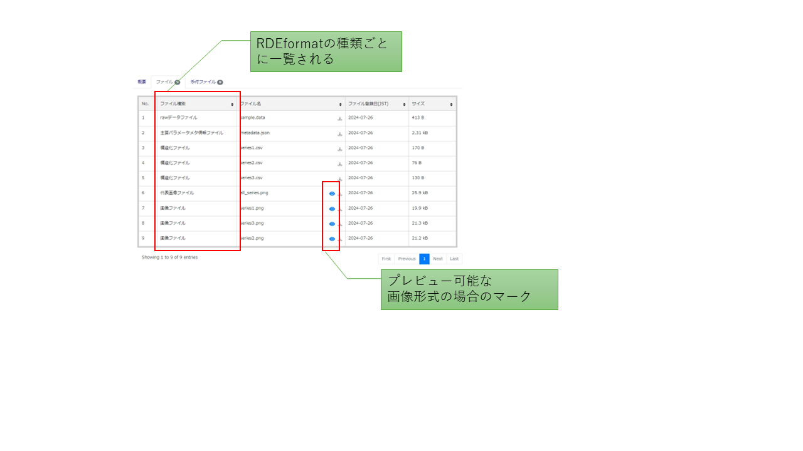
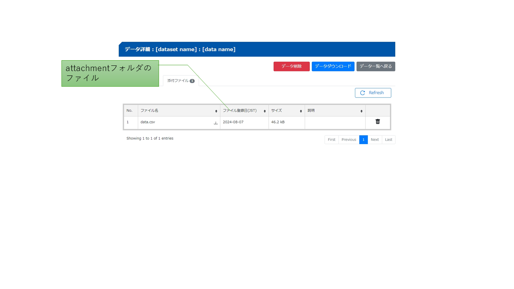

# RDEにおけるデータ構造化処理について

　データ構造化は一般的には事前に定めた構造に整形されたデータのことを示します。RDEにおけるデータ構造化は、RDEで定めたファイル保存形式、メタデータ型式などを生成することを示します。ただし、RDEで「データ構造化処理」と言う場合、データを**可読化・可視化**して利用しやすい特定のデータ形式(データの構造化)にする処理を意味します。そのためデータ構造化処理の一般的機能は、データからメタデータ一覧、グラフ、画像、数値データ(csv)などに変換する処理となっています。<br>
　データ構造化処理の結果はRDEの規定のファイル保存形式で出力することでシステムに登録することができます。このファイル保存形式を**RDEformat**と呼びます。このRDEformat型式の出力をすることがRDEでのデータ構造化処理プログラムの目的となります。

　要点 RDEのデータ構造化 = データ構造化(メタデータ) + データの可読化・可視化(グラフ、数値データ) + 解析・計算


　以降でデータセットテンプレートとデータ構造化処理に関わる各種ファイルについて説明します。

## データ構造化処理の入力と出力

　RDEシステム上でデータ構造化処理が実行される場合、入力情報(各種ファイル含む)はシステムが用意し、それを用いて構造化処理が実行(データセットテンプレートとして登録されたもの)されてRDEformat型式のファイルが作成され、その出力内容が登録(永続化)されるという流れとなっています。


### 入力

　ユーザが送状画面からデータを登録した後、システム上で構造化処理を実行するためにシステムが準備する入力ファイルは以下の表の通りです。

| 入力種類 | 保存先フォルダ | ファイル |
| --- | --- | --- |
| 登録ファイル | inputdata | ユーザが送信したファイル一式 |
| 送状情報 | invoice | invoice.json |
| 添付ファイル | attachment | ユーザが送状画面で添付したファイル一式 |
| テンプレートファイル | tasksupport | テンプレート登録時にtasksupportに保存したファイル |

これらのファイルはコンテナ上で構造化処理プログラムが実行される際にワーキングフォルダのdataフォルダ以下に保存されます。データ構造化処理プログラムはこれらを入力ファイルとして処理を実行します。

### 出力

　構造化処理の結果として出力するファイルおよびフォルダの構成(**RDEformat**)は以下の通りです。

　　なお、構造化処理の実行時には入力と出力は同じフォルダとなり。入力と出力のファイルのうち、次の表の種類のファイルが登録(永続化)対象となります。

| 種類| 出力フォルダ | ファイル種別 | 内容 |
| --- | --- | --- | --- |
| 共有rawデータ | raw | rawデータファイル | inputdataのファイルから共有可能なファイルを保存 |
| 非共有rawデータ | nonshared_raw | 非共有rawデータファイル | inputdataのファイルから非共有とするファイルを保存。研究チーム以外の表示、ダウンロードが不可となる。 |
| メタデータ | metadata | 主要パラメータ情報ファイル | metadata.jsonを配置 |
| ファイルメタ | [top] | -- | filemeta.json(任意) ファイル一覧に非表示|
| 送状 | invoice | -- | invoice.json(入力からの引継ぎ) ファイル一覧に非表示|
| 代表画像 | main_image | 画像ファイル | 画像、グラフなど　複数ある場合はファイル名でソートした１番目のファイルを採用する。|
| 画像 | other_image | 画像ファイル | 画像、グラフなど(画像は区分けをしているがアプリケーションではすべて表示対象となるためシステム上の制約はありません) |
| thumbnail  | thumbnail | -- | データ一覧で利用されるサムネイル画像。複数あった場合は名前の順でソートした一番目が採用される。画像形式jpg、png ファイル一覧非表示、ダウンロードなし |
| 構造化ファイル | structured | 構造化ファイル | 構造化処理で生成されたその他ファイル |
| 添付ファイル | attachment | 添付ファイル | 入力で用意された添付ファイル(入力からの引継ぎ) |
|(複数登録時に利用)|divided|--|1エントリで複数データ登録をする場合に利用。このフォルダの下に0001など4桁の数字のフォルダを作り、RDEformat型式のフォルダを作成する|

**画像に関する留意点**

- RDEのアプリケーション(ブラウザで利用)ではプレビュー可能な画像の形式が限定されています
- 指定拡張子以外の場合は存在しないことを示す画像が表示されます
- 画像ファイルの指定拡張子は以下の表の通りです。

**画像ファイルの指定拡張子**

| 指定拡張子 | 備考 | 
| --- | --- | 
|gif| |
|jpeg| |
|jpg| |
|png| |
|bmp|Webコンテンツとして推奨されている画像形式対象外であるため、Webブラウザの種類によって表示できない可能性がある。|
|ds_store|Apple OSで自動作成されるファイル|
|tif||


### 構造化処理の出力結果とデータ詳細画面での扱いについて

　構造化処理の出力結果とデータ登録後のアプリケーションでの扱いについて以下の通りです。

**データ一覧画面**


**データ詳細画面/概要**


**データ詳細画面/ファイル**


**データ詳細画面/添付ファイル**


## 構造化処理で取り扱う各種ファイルについての説明

　以降で構造化処理で取り扱う各種ファイルの詳細について説明します。

### メタデータ

　メタデータ(metadata)、一般的には、あるデータの属性や関連する情報を記述したデータのことを指します。データ自身が内包している情報を構造化処理よってメタデータファイルとして外に出すことでデータを検索しやすくすることができます。RDEでは一般的なメタデータの使い方に加えて、測定データに含まれる、または解析して得られたメタデータを機械学習の特徴量や教師データとして利用することを想定したものを含めてメタデータと呼んでいます。<br>
　RDEが取り扱うメタデータは大別すると以下の3種類が用意されています。なお、RDEのメタデータはjson型式で出力されます。

| 種類 | 説明|
| --- | --- | 
| invoice | 手入力情報から得られるメタデータ。invoice.jsonから取得する。データの基本情報、装置、試料、手入力情報を扱う|
| metadata | 装置出力データなど登録データファイルから構造化処理により得られたメタデータ |
| filemeta | 登録ファイルに関するメタデータ |

　以下に各種類ごとに説明します。

#### invoice

- invoiceメタデータはinvoice.jsonから取得する
- invoice.jsonというjson型式のファイルとして出力されます
- invoice.jsonは、データの基本情報、試料、装置、手入力情報(固有情報)を取り扱います
- invoice.jsonはテンプレートファイルの１つinvoice.schema.jsonというJSONスキーマファイルで定義されます
- invoice.schema.jsonは送状画面の生成やinvoice.jsonの形式確認に利用されます
- invoice.schema.jsonはinvoice.jsonのJSONスキーマとして利用できるが、basic要素の定義がないため検証ができない
- データ登録する際にシステムがinvoice.jsonを生成し、構造化処理時にシステムから提供されデータ登録時にシステムに保存されます
- データの永続化登録時にinvoice.jsonの内容はinvoice.schema.jsonによるバリデーションが行われ、不整合があれば失敗します。
- なお、invoice.jsonは構造化処理において変更可能
  - 例えば、データ名を構造化処理プログラムで指定し直すことができます


invoiceメタデータは以下の3つの情報の集合から構成されます。

1. basic
  - データの基本情報を記述する
  - データ名、データ所有者、装置の情報
  - システムが生成します
  - 必須項目です
2. sample
  - 試料に関する情報
  - 定義された情報項目の記述
  - sampleは任意要素です
3. custom
  - 固有メタデータとも呼ばれる
  - 手入力メタデータがある場合に記述する
  - customは任意要素です

以下はinvoice.jsonの事例です。
```json
{
  "datasetId" : "[データセットID]",
  "basic" : {
  "dateSubmitted" : "[受付年月日YYYY-MM-DD]",
  "dataOwnerId" : "[データ所有者のDICE ID]",
  "dataName" : "[データ名]",
  "instrumentId" : "[装置ID]",
  "experimentId" : "[実験ID]",
  "description" : "[説明]"
  },
  "custom" : {
  "key1" : "value1",
  "key2" : 999
  },
  "sample" : {
  "sampleId" : "[試料ID]",
  "names" : [ "[試料名]" ],
  "composition" : null,
  "referenceUrl" : null,
  "description" : "[説明]",
  "generalAttributes" : [ {
    "termId" : "[用語ID]",
    "value" : "[値]"
  } ],
  "ownerId" : "[試料所有者のDICE ID]"
  }
}
```
invoice.jsonのスキーマ定義については「データセットテンプレートのバリデーション」を参照

上記のcustom項目のinvoice.schema.jsonは以下の通り。<br>
invoice.schema.jsonはinvoice.jsonのJSONスキーマであり、JSONのバリデーションに利用できます。<br>
```json
{
  "$schema": "https://json-schema.org/draft/2020-12/schema",
  "$id": "https://rde.nims.go.jp/rde/dataset-templates/simple-data-registration_datasettemplate/invoice.schema.json",
  "description": "データセットテンプレート",
  "type": "object",
  "required": [
    "sample",
    "custom"
  ],
  "properties": {
    "custom": {
      "type": "object",
      "label": {
        "ja": "固有情報",
        "en": "Custom Information"
      },
      "required": [],
      "properties": {
        "key1": {
          "label": {
            "ja": "キー1",
            "en": "key1"
          },
          "type": "string"
        },
        "key2": {
          "label": {
            "ja": "キー2",
            "en": "key2"
          },
          "type": "number"
        },
```


### metadata

- 登録データなどから構造化処理で抽出したメタデータ
- JSON型式で作成する
- システムではファイル名metadata.jsonとして出力する
- metadata.jsonはテンプレートファイルの1つmetadata-def.json(メタデータ定義ファイルと呼ぶ)で出力項目を定義する
- ただしmetadata-def.jsonはJSONスキーマではないためmetadata.jsonのバリデーションには利用できない
- 単一出力項目はconstant要素以下に出力する
- 複数出力項目はvariable要素(配列)以下に出力する(データ系列ごとにメタデータの値が異なる場合に利用)

**メタデータの項目の定義について**

　メタデータ(metadata.json)の定義はメタデータ定義(metadata-def.json)に記述します。メタデータ定義はJSONスキーマではないためmetadata.jsonのヴァリデーションに用いることはできません。ただし、RDEtoolKitの機能を利用してメタデータを操作するとメタデータ定義による評価を行うことができます。

メタデータの実例からメタデータとメタデータ定義の関係を説明します。

メタデータ定義でのメタ項目の定義
- メタ項目の項目名が「XrayBeamDiameter」。データ由来の項目名としている。
- データ型はnumber型
- 共通単位があるため"um"として設定

```json
  "XrayBeamDiameter": {
    "name": {
      "ja": "X線ビーム径",
      "en": "Xray Beam Diameter"
    },
    "schema": {
      "type": "number"
    },
    "unit": "um"
  },
```

上記で定義したメタ項目の出力例
- 値はvalueで指定
- unitはメタデータ定義に設定されているが、個別でも設定可。この例では同じ単位だが異なる単位とする場合に利用する。
```json
    "XrayBeamDiameter": {
      "value": 100.0,
      "unit": "um"
    },
```


以下にmetadata.jsonの出力事例を示します。
```json
{
  "constant": {
    "common.data_origin": {"value": "experiments"},
    "common.technical_category": {"value": "measurement"},
    "measurement.method_category": {"value": "分光法"},
    "measurement.method_sub_category": {"value": "オージェ電子分光法"},
    "measurement.analysis_field": {"value": "化学状態, 電子的性質, 不純物分析, 定性分析"},
    "measurement.measurement_environment": {"value": "真空中"},
    "measurement.measured_date": {"value": "2009-07-13"},
    "operation_date_time_year": {"value": 2009},
    "operation_date_time_month": {"value": 7},
    "operation_date_time_day": {"value": 13},
    "operation_date_time_hour": {"value": 10},
    "operation_date_time_minute": {"value": 41},
    "operation_date_time_second": {"value": 29},
    "probe_energy": {"value": "10.00","unit": "keV"},
    "probe_current": {"value": "3.030x10^(-8)","unit": "A"},
    省略
  },
  "variable": [
    {
      "species_label_transitions": {"value": "AlLVV"},
      "abscissa_start": {"value": "42.00","unit": "eV"},
      "abscissa_end": {"value": "76.00","unit": "eV"},
      "abscissa_increment": {"value": "1.00","unit": "eV"},
      "collection_time": {"value": "50","unit": "ms"},
      "total_acquisition_number": {"value": "7"}
    },
    {
      "species_label_transitions": {"value": "AlKLL"},
      "abscissa_start": {"value": "1365.00","unit": "eV"},
      "abscissa_end": {"value": "1408.00","unit": "eV"},
      "abscissa_increment": {"value": "1.00","unit": "eV"},
      "collection_time": {"value": "50","unit": "ms"},
      "total_acquisition_number": {"value": "6"}
    },
    省略
  ]
}
```

### filemeta

- filemetaは、登録する個々のファイルに対してメタデータを追加するときに作成します
- 構造化処理で作成する場合はfilemeta.jsonとして作成します
- ファイル名filemeta.jsonとしてダウンロード時に出力されます
- なお、データ構造化処理で作成しない場合は、システムが自動的に作成します
- データ構造化処理で作成したfilemeta.jsonが存在する場合は、システムが自動生成したものとマージされて出力されます

以下は、構造化処理でfilemeta.jsonを作成しなかった場合にシステムが自動生成したfilemeta.jsonの事例です。
```json
{
  "filemeta" : [ {
  "filename" : "meta/metadata.json",
  "metadata" : { }
  }, {
  "filename" : "main_image/id.png",
  "metadata" : { }
  }, {
  "filename" : "other_image/id_AlKLL.png",
  "metadata" : { }
  }, {
  "filename" : "other_image/id_AlLVV.png",
  "metadata" : { }
  }, {
  "filename" : "other_image/id_AsLMM.png",
  "metadata" : { }
  }, {
  "filename" : "other_image/id_C.png",
  "metadata" : { }
  }, {
  "filename" : "other_image/id_GaLMM.png",
  "metadata" : { }
  }, {
  "filename" : "other_image/id_O.png",
  "metadata" : { }
  }, {
  "filename" : "raw/data",
  "metadata" : { }
  }, {
  "filename" : "raw/id",
  "metadata" : { }
  }, {
  "filename" : "raw/para",
  "metadata" : { }
  }, {
  "filename" : "structured/id.csv",
  "metadata" : { }
  } ]
}
```

以下はfilemeta.jsonを構造化処理で作成しメタデータをファイルに付加した事例です。
```json
{
  "filemetadata": [
    {
      "filename": "structured/20100130115018(wide).csv",
      "metadata": {
        "format": {
          "itemtype": "format",
          "name": {
            "ja": "ファイルフォーマット",
            "en": "file format"
          },
          "value": "csvw",
          "schema": {
            "type": "string"
          }
        },
        "column0": {
          "itemtype": "discriptor",
          "datatype": "number",
          "name": {
            "ja": "列名",
            "en": "column"
          },
          "value": "Kinetic Energy",
          "unit": "eV",
          "url": "https://en.wikipedia.org/wiki/Kinetic_energy",
          "schema": {
            "type": "string"
          }
        }
      }
    }
  ]   
}
```

### タクソノミー(taxonomy)

登録したメタデータのうちデータの分類に利用する項目をタクソノミーと呼びます。タクソノミーはデータセット単位で任意に設定することができ、指定することでデータの詳細検索の条件やデータ一覧画面でのツリー表示に利用されます。タクソノミーはテンプレートに設定されるものではなく、個々のデータセットセットで随時設定できます。

タクソノミーを設定した場合のツリー表示の例は以下の通りです。

この例ではタクソノミーとして
- invoice.basic.date_submitted
- invoice.basic.data_name
- invoice.basic.experiment_id

の3項目を指定しています。<br>
データセット編集画面でタクソノミキーを複数している場合は、各項目を半角スペース区切りで入力します。


タクソノミーとして指定できるメタデータは各データセットテンプレートのinvoice.schema.json、metadata-def.jsonで定義された項目および装置マスタの一部項目です。タクソノミーとして利用できる項目と記述方法を以下の表に一覧します。

**基本情報(invoiceより)**

| ソース | 項目 | キー名 |説明|
|---|---|---|---|
| invoice | basicのdateSubmitted| invoice.basic.date_submitted |　記入年月日 |
| invoice | basicのdata_owner | invoice.basic.data_oner | データの所有者と所属 |
| invoice | basicのdataName | invoice.basic.data_name | データ名 |
| invoice | basicのinstrumentId | invoice.basic.instrument_id | 実験ID | 
| invoice | basicのdescription | invoice.basic.description | データの説明 | 


**装置情報**

| ソース | 項目 | キー名 |説明|
|---|---|---|---|
| - | - | instrument.name | 装置登録名 |  
| - | - | instrument.organization | 装置の管理機関 |  
| - | - | instrument.description | 装置の説明 |  


**試料情報(invoiceなどより)**

| ソース | 項目 | キー名 |説明|
|---|---|---|---|
| invoice | sampleのnames[] | sample.name | 試料のローカルIDの最初の一つ |
| invoice | sampleのcomposition | sample.composition | 化学式・組成式・分子式など |
| invoice | sampleのdescription | sample.description | 試料の説明 |
| -  | sampleのgeneralのキー名 | sample.general.<キー名> | 一般試料用語のキー名 |
| -  | sampleのspecificのキー名 | sample.specific.<キー名> | 特定試料用語のキー名 |


**固有情報(invoice、metadataより)**

| ソース | 項目 | キー名 |説明|
|---|---|---|---|
| invoice | customのキー名 | invoice.custom.<キー名> | 送状のcustom項目。定義した項目がキャメルケースの場合はケバブ形式で変換して指定する |
| metadata | constantのキー名 | <キー名> | metadataのconstantの項目。定義した項目名をそのまま記述　|
| metadata | variableのキー名 | <キー名> | metadataのvariableの項目。定義した項目名をそのまま記述　|


### 送状画面から登録された測定データファイルなど取扱いについて

　送状画面から登録された測定データファイルなどは、構造化処理においてinputdataフォルダに保存されています。<br>
　登録されたファイルは装置から出力された未加工のデータファイルや計算結果などが想定されます。これらをRDEではRAWファイルと呼んでいます。このRAWファイルを特定のユーザにのみダウンロード可(これを非共有と呼ぶ)とするか制限しないようにするかを構造化処理で決定することができます(登録後は変更ができません)。以下のように所定のフォルダにコピーすることで共有の可否を変更することができます。

|RAWデータファイルの共有設定|処理|
|---|---|
|共有可|rawフォルダに対象RAWファイルを保存する|
|共有不可|nonshared_rawフォルダに対象RAWファイルを保存する|

RAWデータの共有の可否は構造化処理プログラムの作り方しだいでデータ単位に設定することもできます。通常はデータセットテンプレート単位で共有可・不可は一律としています。

### 画像の取扱い

　RDEのアプリケーションにて、画像として表示したいファイルはmain_image、other_imageのいずれかのフォルダに保存します。main_imageは代表画像、other_imageは画像とシステム上の区分けは用意されていますが、区分けによるアプリケーションでの表示の差はわずかです。システム運用上も明確な区分けを設けていませんので、各データセットテンプレートで適宜利用してください。また、thumbnailフォルダにサムネイル画像を保存するとデータ一覧でサムネイル表示されます。<br>
なお、サムネイル、代表画像、画像が登録されていない場合は、画像を表示するページでは"No Image"と表示される画像が利用されます。

代表画像、画像、サムネイルのアプリケーション上での動作は以下の通りです。
- 代表画像、画像は、データ詳細画面で表示される。その際、代表画像、画像でそれぞれファイル名でソートした順に表示される。
- 代表画像を一つ選ぶ場合は、名前の順でソートした一番先頭のファイルが利用される
- 代表画像、画像は、データ詳細画面のファイル一覧に表示される
- サムネイル画像はデータ一覧表示で利用されます
- サムネイル画像はファイル一覧に表示されず、ダウンロードに含まれません

Hint : 画像の区分けについて。データの内容を画像として表示する場合は代表画像(main_image)に、グラフなどの作成物を画像(other_image)として区分けするという方法も考えられます。
Hint : 顕微鏡写真のtif型式などのファイルは画像とRAWデータという二つの用途を兼ねている場合があります。このようなファイルを画像としてプレビューできるようにしたい場合は、元ファイルからプレビュー可能な画像形式にしたものをmain_imageなどに保存し、元ファイルをrawまたはnonshared_rawに保存するという方法があります。

**データ一覧画面(ギャラリー)の表示例(NoImageあり)**


<div class="page" />

