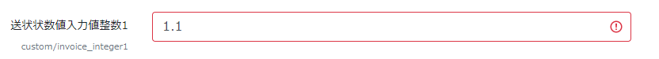

# データセットテンプレート詳細

## テンプレートファイルと役割

　テンプレートファイル名と用途などは次の通りです(再掲)。

| テンプレートファイル | 必須 | 対応ファイル | 用途など |
| --- | --- | --- | --- | 
| invoice.schema.json | 必須 | invoice.json | 送状スキーマ。データ受入の生成に利用される。また、invoice.jsonのヴァリデーションに利用される。ただし、invoice.schema.jsonはinvoice.jsonの全項目を網羅していない。構造化処理プログラムでも利用。 |
| metadata-def.json | 必須 | metadata.json | メタデータ定義。metadata.jsonの項目ごとの定義に利用される。JSONスキーマではないためヴァリデーションには利用できない。構造化処理プログラムでも利用。RDEToolKitはmetadata-def.jsonからmetadata.jsonを生成することができる。|
| catalog.schema.json | 必須 | catalog.json | カタログスキーマ。データセット詳細のカタログ画面に利用される |
| jobs.template.yaml | 必須 | - | バッチ定義。構造化処理バッチの処理内容を記述する |
| batch.yaml | - | - | データ構造化定義(既定のpool以外を利用する場合などに利用) |
| タスク補助ファイル(tasksupport) | - | - | 構造化処理で利用する上記以外のファイル |
| Dockerコンテナイメージ| - | - | 構造化処理プログラムと実行環境 |

上記で一覧したテンプレートファイルはファイル名が固定されているため名前は変更することができません。ただし、tasksupportフォルダ以下に置く補助的ファイルのファイル名は任意です。

以降で各テンプレートファイルの詳細を説明をします。

### 送状テンプレート[invoice.schema.json]

参考:02_永続化ファイル設計.pdf

invoice.schema.jsonについて説明します。

- 送状スキーマは送状画面の生成に利用されます
- ただし、基本情報は送状スキーマに記述しなくても画面に反映されます
- データの登録処理においてinvoice.schema.jsonの定義に合致しない場合は登録エラーとなります
- 送状スキーマの書式については別紙「」を参照してください

#### 固有情報の定義
　
- 送状を用いて手入力のメタデータをと登録する場合、固有情報(custom)要素を定義します。
- 固有情報の項目を送状テンプレートで定義すると、送状画面に入力欄が用意されます。
- 以下に、定義できるメタデータの型と画面上の入力欄の表示の例を示します。

送状テンプレートで定義できるデータの型は以下の通りです。

|type | format | enum | 説明 |
| --- | --- | --- | --- |
| number | - |- | 実数|
| integer | - | - | 整数 |
| string | - | - | 文字列 |
| string | - | - | 文字列<br>widgeでtextareaを指定すると入力がtextareaとなる |
| string | date | - | 日付。RFC 3339のfull-date<br>例:2003-07-07T00:00:00+09:00、<br>2003-07-07T00:00:00Z|
| string | time | - |時刻。RFC 3339のfull-time<br>例:00:00:00+09:00、<br>00:00:00Z|
| string |  |[選択肢列挙]|文字列。入力は選択肢から選択|
| string | uri | - |文字列。uriを使う場合|
| string | uuid | - |文字列。uuidを使う場合|

以上の型の定義に加え、送状画面での操作などに関わるoptionsを指定することができる。

以降に送状テンプレートのtypeとアプリケーション画面の事例を列挙します。

#### string
文字列を入力する項目に利用

```json
"invoice_string1": {
  "label": {
    "ja": "送状文字入力値1",
    "en": "invoice_string1"
  },
  "type": "string"
},
```
アプリではinput(html)として表示されます。

複数行の入力をするときの定義例<br>
UIの設定はoptions要素で定義します。<br>
ただし、登録時には改行コード付きの文字列として登録されます


```json
"inboice_string2": {
  "label": {
    "ja": "送状文字入力値2",
    "en": "inboice_string2"
  },
  "type": "string",
  "options": {
    "widget": "textarea",
    "rows": 3
  }
},
```
アプリではtextarea(html)として表示されます。

#### 選択項目


```json
"is_devided": {
  "label": {
    "ja": "複数データ登録の有無",
    "en": "is_devided"
  },
  "type": "string",
  "enum": [
    "有",
    "無"
  ]
}
```

アプリではselect(html)として表示されます。

#### number
実数を入力する項目に利用


```json
"invoice_number1": {
  "label": {
  "ja": "送状状数値入力値1",
    "en": "invoice_number1"
  },
  "type": "number"
},
```

#### integer
整数を入力する項目に利用

```json
"invoice_integer1": {
  "label": {
  "ja": "送状状数値入力値整数1",
    "en": "invoice_integer1"
  },
  "type": "integer"
},
```
整数以外を入力して登録をしようとすると警告が表示され登録が中断されます。<br>
整数欄に実数を入れた場合の警告表示


#### string(format=date)
年月日を入力する項目に利用<br>
typeとformat指定を組み合わせて定義します


```json
"measurement_date": {
  "label": {
    "ja": "測定日時",
    "en": "measurement date"
  },
  "type": "string",
  "format": "date"
},
```
なお、日付項目はアプリでは日付入力のガジェット(html)が適用されます。


#### 試料情報項目の定義

- 送状(invoice)における試料情報は基本情報、一般項目、分類別項目に大別されます。
- 基本情報は試料名、試料管理者など基本的情報を保存するためのもので、invoice.schema.jsonで項目を列挙する必要がありません。required要素(配列)に"sample"を追加するだけで利用できるようになります
- 一般項目、分類別項目は、RDEに予め登録された用語(term)と用語分類(class)を指定することで入力枠を生成することができます
- 用語と用語分類は、テンプレート生成様式(エクセルファイル)で提供されます


**試料基本項目**
試料の基本項目はシステムで予め定めらた項目が表示されます。

以下のようにrequiredでsampleを指定、propertiesにsample{}を入力しておくとシステム既定の項目が表示されます。

```json
  "$schema": "https://json-schema.org/draft/2020-12/schema",
  "$id": "https://rde.nims.go.jp/rde/dataset-templates/dataset_template__material_minimum_sample/invoice.schema.json",
  "description": "RDEデータセットテンプレートサンプル試料最小構成invoice",
  "type": "object",
  "required": [
    "sample"
  ],
  "properties": {
    "sample": {
      "type": "object",
      "label": {
        "ja": "試料情報",
        "en": "Sample Information"
      },
      "properties": {}
    }
  }
}
```


**一般項目の定義**

一般項目を定義する場合は以下のようにgeneralAttributesのitemsに定義します。割り当てる項目をtermIdで指定します。
```json
      "properties": {
        "generalAttributes": {
          "type": "array",
          "items": [
            {
              "type": "object",
              "required": [
                "termId"
              ],
              "properties": {
                "termId": {
                  "const": "3adf9874-7bcb-e5f8-99cb-3d6fd9d7b55e"
                }
              }
            },
```

上記のように一般項目(generalAttributes)を定義すると以下のように画面に入力項目が表示されます。
- 名称は、指定したtermIdで登録されたマスタデータが取得された名称が出力されます
- また、名称はブラウザの言語設定に合わせて日本語/英語が自動的に表示されます
- 入力はすべてstring扱いです
- これらの項目をtaxonomyとして利用する場合のキー名は一般項目一覧を参照してください


**分類別項目の定義**
分類別項目を定義する場合は以下のようにspecificAttributesのitemsに定義します。割り当てる項目を分類のclassIdとtermIdの組み合わせで指定します。
```json
      "properties": {
        "specificAttributes": {
          "type": "array",
          "items": [
            {
              "type": "object",
              "required": [
                "classId",
                "termId"
              ],
              "properties": {
                "classId": {
                  "const": "52148afb-6759-23e8-c8b8-33912ec5bfcf"
                },
                "termId": {
                  "const": "70c2c751-5404-19b7-4a5e-981e6cebbb15"
                }
              }
            },
```
上記のように分類別項目(specificlAttributes)を定義すると以下のように画面に入力項目が表示されます。
- 名称は、指定したclassIdとtermIdで登録されたマスタデータが取得された名称が出力されます
- また、名称はブラウザの言語設定に合わせて日本語/英語が自動的に表示されます
- 入力はすべてstring扱いです
- これらの項目をtaxonomyとして利用する場合のキー名は一般項目一覧を参照してください


<div class="page" />

### invoice.schema.jsonの事例

以下に、invoice.schema.jsonの事例を紹介します。
送状(invoice)で取り扱う基本情報、試料情報、固有情報の組み合わせを変えた事例となっています。

#### 送状基本情報のみ
<details><summary>code & sample view</summary>

```json
{
  "$schema": "https://json-schema.org/draft/2020-12/schema",
  "$id": "https://rde.nims.go.jp/rde/dataset-templates/dataset_template__minimum_sample/invoice.schema.json",
  "description": "RDEデータセットテンプレートサンプル最小構成invoice",
  "type": "object",
  "required": [],
  "properties": {}
}
```

表示例


</details>

<div class="page" />

#### 送状基本情報+試料基本情報
<details><summary>code & sample view</summary>

```json
{
  "$schema": "https://json-schema.org/draft/2020-12/schema",
  "$id": "https://rde.nims.go.jp/rde/dataset-templates/dataset_template__material_minimum_sample/invoice.schema.json",
  "description": "RDEデータセットテンプレートサンプル試料最小構成invoice",
  "type": "object",
  "required": [
    "sample"
  ],
  "properties": {
    "sample": {
      "type": "object",
      "label": {
        "ja": "試料情報",
        "en": "Sample Information"
      },
      "properties": {}
    }
  }
}
```

**表示例**


</details>

<div class="page" />

#### 送状基本情報+試料基本情報+試料追加情報
<details><summary>code & sample view</summary>

```json
{
  "$schema": "https://json-schema.org/draft/2020-12/schema",
  "$id": "https://rde.nims.go.jp/rde/dataset-templates/dataset_template__material_option_sample/invoice.schema.json",
  "description": "RDEデータセットテンプレートサンプル試料オプションありinvoice",
  "type": "object",
  "required": [
    "sample"
  ],
  "properties": {
    "sample": {
      "type": "object",
      "label": {
        "ja": "試料情報",
        "en": "Sample Information"
      },
      "properties": {
        "generalAttributes": {
          "type": "array",
          "items": [
            {
              "type": "object",
              "required": [
                "termId"
              ],
              "properties": {
                "termId": {
                  "const": "3adf9874-7bcb-e5f8-99cb-3d6fd9d7b55e"
                }
              }
            },
            {
              "type": "object",
              "required": [
                "termId"
              ],
              "properties": {
                "termId": {
                  "const": "0aadfff2-37de-411f-883a-38b62b2abbce"
                }
              }
            },
            {
              "type": "object",
              "required": [
                "termId"
              ],
              "properties": {
                "termId": {
                  "const": "0444cf53-db47-b208-7b5f-54429291a140"
                }
              }
            },
            {
              "type": "object",
              "required": [
                "termId"
              ],
              "properties": {
                "termId": {
                  "const": "e2d20d02-2e38-2cd3-b1b3-66fdb8a11057"
                }
              }
            }
          ]
        },
        "specificAttributes": {
          "type": "array",
          "items": [
            {
              "type": "object",
              "required": [
                "classId",
                "termId"
              ],
              "properties": {
                "classId": {
                  "const": "52148afb-6759-23e8-c8b8-33912ec5bfcf"
                },
                "termId": {
                  "const": "70c2c751-5404-19b7-4a5e-981e6cebbb15"
                }
              }
            },
            {
              "type": "object",
              "required": [
                "classId",
                "termId"
              ],
              "properties": {
                "classId": {
                  "const": "961c9637-9b83-0e9d-e60e-ffc1e2517afd"
                },
                "termId": {
                  "const": "70c2c751-5404-19b7-4a5e-981e6cebbb15"
                }
              }
            },
            {
              "type": "object",
              "required": [
                "classId",
                "termId"
              ],
              "properties": {
                "classId": {
                  "const": "01cb3c01-37a4-5a43-d8ca-f523ca99a75b"
                },
                "termId": {
                  "const": "dc27a956-263e-f920-e574-5beec912a247"
                }
              }
            }
          ]
        }
      }
    }
  }
}
```

**表示例**


</details>

<div class="page" />

#### 送状基本情報+固有情報
<details><summary>code & sample view</summary>

```json
{
  "$schema": "https://json-schema.org/draft/2020-12/schema",
  "$id": "https://rde.nims.go.jp/rde/dataset-templates/dataset_template_custom_sample/invoice.schema.json",
  "description": "RDEデータセットテンプレートサンプル固有情報invoice",
  "type": "object",
  "required": [
    "custom"
  ],
  "properties": {
    "custom": {
      "type": "object",
      "label": {
        "ja": "固有情報",
        "en": "Custom Information"
      },
      "required": [
        "measurement_date",
        "invoice_string1"
      ],
      "properties": {
        "measurement_date": {
          "label": {
            "ja": "測定日時",
            "en": "measurement date"
          },
          "type": "string",
          "format": "date"
        },
        "invoice_number1": {
          "label": {
            "ja": "送状状数値入力値1",
            "en": "invoice_number1"
          },
          "type": "number"
        },
        "invoice_number2": {
          "label": {
            "ja": "送状状数値入力値2",
            "en": "invoice_number2"
          },
          "type": "number"
        },
        "invoice_string1": {
          "label": {
            "ja": "送状文字入力値1",
            "en": "invoice_string1"
          },
          "type": "string"
        },
        "inboice_string2": {
          "label": {
            "ja": "送状文字入力値2",
            "en": "inboice_string2"
          },
          "type": "string",
          "options": {
            "widget": "textarea",
            "rows": 3
          }
        },
        "invoice_list1": {
          "label": {
            "ja": "送状状選択値1",
            "en": "invoice_list1"
          },
          "type": "string",
          "enum": [
            "selectable1",
            "selectable2",
            "selectable3"
          ]
        }
      }
    }
  }
}
```

**表示例**


</details>

<div class="page" />


### 送状基本情報+試料基本情報+試料追加情報+固有情報
<details><summary>code & sample view</summary>

```json
{
  "$schema": "https://json-schema.org/draft/2020-12/schema",
  "$id": "https://rde.nims.go.jp/rde/dataset-templates/dataset_template__material_custom_sample/invoice.schema.json",
  "description": "RDEデータセットテンプレートサンプル試料と固有情報invoice",
  "type": "object",
  "required": [
    "custom",
    "sample"
  ],
  "properties": {
    "custom": {
      "type": "object",
      "label": {
        "ja": "固有情報",
        "en": "Custom Information"
      },
      "required": [
        "measurement_date",
        "invoice_string1"
      ],
      "properties": {
        "measurement_date": {
          "label": {
            "ja": "測定日時",
            "en": "measurement date"
          },
          "type": "string"
        },
        "invoice_number1": {
          "label": {
            "ja": "送状状数値入力値1",
            "en": "invoice_number1"
          },
          "type": "number"
        },
        "invoice_number2": {
          "label": {
            "ja": "送状状数値入力値2",
            "en": "invoice_number2"
          },
          "type": "number"
        },
        "invoice_string1": {
          "label": {
            "ja": "送状文字入力値1",
            "en": "invoice_string1"
          },
          "type": "string"
        },
        "inboice_string2": {
          "label": {
            "ja": "送状文字入力値2",
            "en": "inboice_string2"
          },
          "type": "string",
          "options": {
            "widget": "textarea",
            "rows": 3
          }
        },
        "invoice_list1": {
          "label": {
            "ja": "送状状選択値1",
            "en": "invoice_list1"
          },
          "type": "string",
          "enum": [
            "selectable1",
            "selectable2",
            "selectable3"
          ]
        }
      }
    },
    "sample": {
      "type": "object",
      "label": {
        "ja": "試料情報",
        "en": "Sample Information"
      },
      "properties": {
        "generalAttributes": {
          "type": "array",
          "items": [
            {
              "type": "object",
              "required": [
                "termId"
              ],
              "properties": {
                "termId": {
                  "const": "3adf9874-7bcb-e5f8-99cb-3d6fd9d7b55e"
                }
              }
            },
            {
              "type": "object",
              "required": [
                "termId"
              ],
              "properties": {
                "termId": {
                  "const": "0aadfff2-37de-411f-883a-38b62b2abbce"
                }
              }
            },
            {
              "type": "object",
              "required": [
                "termId"
              ],
              "properties": {
                "termId": {
                  "const": "0444cf53-db47-b208-7b5f-54429291a140"
                }
              }
            },
            {
              "type": "object",
              "required": [
                "termId"
              ],
              "properties": {
                "termId": {
                  "const": "e2d20d02-2e38-2cd3-b1b3-66fdb8a11057"
                }
              }
            }
          ]
        },
        "specificAttributes": {
          "type": "array",
          "items": [
            {
              "type": "object",
              "required": [
                "classId",
                "termId"
              ],
              "properties": {
                "classId": {
                  "const": "52148afb-6759-23e8-c8b8-33912ec5bfcf"
                },
                "termId": {
                  "const": "70c2c751-5404-19b7-4a5e-981e6cebbb15"
                }
              }
            },
            {
              "type": "object",
              "required": [
                "classId",
                "termId"
              ],
              "properties": {
                "classId": {
                  "const": "961c9637-9b83-0e9d-e60e-ffc1e2517afd"
                },
                "termId": {
                  "const": "70c2c751-5404-19b7-4a5e-981e6cebbb15"
                }
              }
            },
            {
              "type": "object",
              "required": [
                "classId",
                "termId"
              ],
              "properties": {
                "classId": {
                  "const": "01cb3c01-37a4-5a43-d8ca-f523ca99a75b"
                },
                "termId": {
                  "const": "dc27a956-263e-f920-e574-5beec912a247"
                }
              }
            }
          ]
        }
      }
    }
  }
}
```

**表示例**


</details>

<div class="page" />

### invoice.schema.jsonに記載されない定義について

　invoice.schema.jsonはデータ受入画面を生成するための定義書かつ基本情報、試料、固有情報のメタデータを定義するためのJSONスキーマでありデータセットテンプレートとなっています。<br>
　ただし、基本情報、試料情報の一部はシステムが自動生成するためinvoice.schema.jsonに定義を記載する必要がありません。ここでは基本情報などinvoice.schema.jsonでは記載を省略できる項目に対するJSONスキーマを紹介します。


### 送状基本情報、試料のJSONスキーマ(invoice.schema.json)のjsonスキーマ

invoiceのbasic、sample(basic)は、invoice.schema.jsonでは定義されていないためバリデーションを行うことができません。invoice.schema.jsonのJSONスキーマの事例を紹介します。

**invoice_basic_and_sample.schema.json**

```json
{
  "$schema": "https://json-schema.org/draft-07/schema",
  "description": "invoice_basic_schema/when adding samples",
  "type": "object",
  "required": [
    "basic",
    "datasetId"
  ],
  "properties": {
    "datasetId": {
      "type": "string"
    },
    "basic": {
      "type": "object",
      "label": {
        "ja": "送状基本情報",
        "en": "Invoice Basic Information"
      },
      "required": [
        "dateSubmitted",
        "dataOwnerId",
        "dataName"
      ],
      "properties": {
        "dateSubmitted": {
          "type": "string",
          "format": "date"
        },
        "dataOwnerId": {
          "type": "string",
          "pattern": "^([0-9a-zA-Z]{56})$"
        },
        "dateName": {
          "type": "string",
          "pattern": "^.*"
        },
        "instrumentId": {
          "type": [
            "string",
            "null"
          ],
          "pattern": "^$|^([0-9a-zA-Z]{8}-[0-9a-zA-Z]{4}-[0-9a-zA-Z]{4}-[0-9a-zA-Z]{4}-[0-9a-zA-Z]{12})$"
        },
        "experimentId": {
          "type": [
            "string",
            "null"
          ]
        },
        "description": {
          "type": [
            "string",
            "null"
          ]
        }
      }
    },
    "sample": {
      "anyOf": [
        {
          "$ref": "#/definitions/sample/sampleWhenAdding"
        },
        {
          "$ref": "#/definitions/sample/sampleWhenRef"
        }
      ]
    }
  },
  "definitions": {
    "sample": {
      "sampleWhenAdding": {
        "type": "object",
        "required": [
          "sampleId",
          "names",
          "ownerId"
        ],
        "properties": {
          "sampleId": {
            "type":  "string",
            "pattern": "^$"
          },
          "names": {
            "type": "array"
          },
          "ownerId": {
            "description": "sample ownere id",
            "type": "string",
            "pattern": "^([0-9a-zA-Z]{56})$"
          },
          "composition": {
            "type": [
              "string",
              "null"
            ]
          },
          "referenceUrl": {
            "type": [
              "string",
              "null"
            ]
          },
          "description": {
            "type": [
              "string",
              "null"
            ]
          },
          "generalAttributes": {
            "type": "array",
            "properties": {
              "termId": {
                "type": [
                  "string",
                  "null"
                ],
                "pattern": "^([0-9a-f]{8})-([0-9a-f]{4})-([0-9a-f]{4})-([0-9a-f]{4})-([0-9a-f]{12})$"
              },
              "value": {
                "type": [
                  "string",
                  "null"
                ]
              }
            }
          },
          "specificAttributes": {
            "type": "array",
            "properties": {
              "classId": {
                "type": [
                  "string",
                  "null"
                ],
                "pattern": "^([0-9a-f]{8})-([0-9a-f]{4})-([0-9a-f]{4})-([0-9a-f]{4})-([0-9a-f]{12})$"
              },
              "termId": {
                "type": [
                  "string",
                  "null"
                ],
                "pattern": "^([0-9a-f]{8})-([0-9a-f]{4})-([0-9a-f]{4})-([0-9a-f]{4})-([0-9a-f]{12})$"
              },
              "value": {
                "type": [
                  "string",
                  "null"
                ]
              }
            }
          }
        }
      },
      "sampleWhenRef": {
        "type": "object",
        "required": [
          "sampleId"
        ],
        "properties": {
          "sampleId": {
            "type": "string",
            "pattern": "^([0-9a-f]{8})-([0-9a-f]{4})-([0-9a-f]{4})-([0-9a-f]{4})-([0-9a-f]{12})$"
          },
          "names": {
            "type": "array"
          },
          "ownerId": {
            "description": "sample ownere id",
            "type": "string",
            "pattern": "^([0-9a-zA-Z]{56})$"
          },
          "composition": {
            "type": [
              "string",
              "null"
            ]
          },
          "referenceUrl": {
            "type": [
              "string",
              "null"
            ]
          },
          "description": {
            "type": [
              "string",
              "null"
            ]
          },
          "generalAttributes": {
            "type": "array",
            "properties": {
              "termId": {
                "type": [
                  "string",
                  "null"
                ],
                "pattern": "^([0-9a-f]{8})-([0-9a-f]{4})-([0-9a-f]{4})-([0-9a-f]{4})-([0-9a-f]{12})$"
              },
              "value": {
                "type": [
                  "string",
                  "null"
                ]
              }
            }
          },
          "specificAttributes": {
            "type": "array",
            "properties": {
              "classId": {
                "type": [
                  "string",
                  "null"
                ],
                "pattern": "^([0-9a-f]{8})-([0-9a-f]{4})-([0-9a-f]{4})-([0-9a-f]{4})-([0-9a-f]{12})$"
              },
              "termId": {
                "type": [
                  "string",
                  "null"
                ],
                "pattern": "^([0-9a-f]{8})-([0-9a-f]{4})-([0-9a-f]{4})-([0-9a-f]{4})-([0-9a-f]{12})$"
              },
              "value": {
                "type": [
                  "string",
                  "null"
                ]
              }
            }
          }
        }
      }
    }
  }
}
```
<div class="page" />

## メタデータ定義[metadata-def.json]

### メタデータ定義(metadata-def.json)について

- メタデータ定義はメタデータファイルの生成などに利用されます
- データセット詳細、データ詳細のメタ項目一覧における項目名、単位の出力に用いられます
- また、メタデータ定義は抽出されたメタデータの内容を説明するファイルとして利用できるため、メタデータ定義は組み合わせて使うものと位置付けています
- メタデータ定義は他のテンプレートとは異なりJSONスキーマ形式とはなっていないため、JSONのバリデーションには利用できません。

メタデータ定義の基本構成は以下の通りです。
- item_nameの箇所に装置出力データから取得した項目名を割り当てます
- name/ja、name/enは画面表示の項目名を指定します
- scehamaには、メタ項目のデータ型を指定します。invoiec.schema.jsonにおけるtype、formatとほぼ同じ内容です
- variableは、その項目が複数個出力される場合に定義します。単一出力の場合は定義する必要はありません。例えば、複数系列のメタデータ項目がある場合に利用します。
- orderは表示順を指定します。画面における一覧時の並び順となります。必須ではありません。


```json
{
  "item_name": {
    "name": {
      "ja": "アイテム名",
      "en": "item name"
    },
    "schema": {
      "type": "string"
    },
    "variable": 1,
    "order": 1,
  }
}
```

### constantとvariable

- メタデータ定義でvariable=1指定されたものはメタデータではvariable要素に配列として出力されます
- variableの指定がないものは、メタデータではconstant要素の子要素として出力されます
- 以下にその事例を示します

メタデータ定義の事例
```json
{
  "measurement_date": {
    "name": {
      "ja": "測定日",
      "en": "measurement date"
    },
    "schema": {
      "type": "string",
      "format": "date"
    },
    "order": 1,
  },
  "series_name": {
    "name": {
      "ja": "系列名",
      "en": "series name"
    },
    "schema": {
      "type": "string"
    },
    "order": 2,
    "variable":1
  }
}
```

上記メタデータ定義に基づき出力されたメタデータの実例
```json
{
  "constant": {
    "measurement_date": {
      "value": "2024-08-05"
    }
  },
  "variable": [
    {
      "series_name": {
        "value": "series1"
      }
    },
    {
      "series_name": {
        "value": "series2"
      }
    }
  ]
}
```

**表示例**

この例では系列名がvariable指定された項目であり、列項目名に値1、値2と表示さた列に値が出力されています。


### データ型:arrayの取扱い
データ型はinvoice.schema.jsonとほぼ同じですが、メタデータ定義にはarray型があります。ただし、これの利用には以下の制約があるため、使用に際しては注意をしてください。

- array型のメタデータは登録できますが、RDEアプリの表示上は配列全体が一つの文字列として表示されます
- ただし、metadata.jsonファイルはそのまま保存され、ダウンロード時も保存時の状態で取り出すことができます


```json
  "meta_array":{
    "name":{
      "ja": "配列値",
      "en": "array_value"
    },
    "schema": "array"
  }
}

```


```json
{
  "constant": {
    "meta_array": {
      "value": [
        1,　2,　3,　4,　5,　6,　7,　8
      ]
    }
  }
}
```


## データセットカタログテンプレート[catalog.schema.json]
- データセットのカタログの入力様式はcatalog.schema.jsonで定義します
- データセット詳細のデータカタログはcatalog.schema.jsonを元に表示、入力画面が生成されます
- データセット詳細のデータカタログで「編集」することでcatalog.jsonが生成されます
- なお、未作成の場合は、ダウンロードに含まれるcatalog.jsonの内容は以下の通りです

データセットカタログが未編集の場合のcatalog.jsonの内容
```json
null
```

catalog.schema.jsonの一例を掲載します。
```json
{
  "$schema": "https://json-schema.org/draft/2020-12/schema",
  "$id": "https://rde.nims.go.jp/rde/dataset-templates/NIMS_TRIAL_DATASETTEMPLATE-1/catalog.schema.json",
  "type": "object",
  "required": [
    "catalog"
  ],
  "description": "NIMS_TRIAL_DATASETTEMPLATE-1",
  "properties": {
    "catalog": {
      "type": "object",
      "label": {
        "ja": "RDEトライアルデータセットテンプレート-1",
        "en": "RDE trial datasettemplate-1"
      },
      "required": [],
      "properties": {
        "dataset_title": {
          "label": {
            "ja": "データセット名",
            "en": "Dataset Title"
          },
          "type": "string"
        },
        "abstract": {
          "label": {
            "ja": "概要",
            "en": "Abstract"
          },
          "type": "string"
        },
        "data_creator": {
          "label": {
            "ja": "作成者",
            "en": "Data Creator"
          },
          "type": "string"
        },
        "experimental_apparatus": {
          "label": {
            "ja": "使用装置",
            "en": "Experimental Apparatus"
          },
          "type": "string"
        },
        "data_distribution": {
          "label": {
            "ja": "データの再配布",
            "en": "Data Distribution"
          },
          "type": "string"
        },
        "raw_data_type": {
          "label": {
            "ja": "データの種類",
            "en": "Raw Data Type"
          },
          "type": "string"
        },
        "stored_data": {
          "label": {
            "ja": "格納データ",
            "en": "Stored Data"
          },
          "type": "string"
        },
        "remarks": {
          "label": {
            "ja": "備考",
            "en": "Remarks"
          },
          "type": "string"
        },
        "references": {
          "label": {
            "ja": "参考論文",
            "en": "References"
          },
          "type": "string"
        }
      }
    }
  }
}
```

## バッチ定義[jobs.template.yaml,batch.yaml]

下記の定義ファイルは実例を示したものです。<br>
この定義ファイルには、プログラムなど実行環境をまとめたDocker image、実行するプログラムなどが記載されています。
なお、これらのファイルはNIMSが提供します。<br>


### jobs.template.yaml
利用するDocker image(docker_image)の指定、実行するコマンド(command)を指定します。その他の設定は変更はしません。なお、RDEの構造化処理のコマンドは<br>
command: python /app/main.py<br>
が標準となります。

```yaml
job_specifications:
- id: ${job-id}
  allow_run_on_missing_image: true
  auto_complete: true
  max_task_retries: 0
  tasks:
  - id: task_1
  docker_image: rdecontreg.azurecr.io/nims_trial_datasettemplate_1:v.1.6
  command: python /app/main.py
  input_data:
    azure_storage:
    - storage_account_settings: mystorageaccount
    remote_path: ${job-dir}
    local_path: ${AZ_BATCH_TASK_WORKING_DIR}/data
  output_data:
    azure_storage:
    - storage_account_settings: mystorageaccount
    remote_path: ${job-dir}
    local_path: ${AZ_BATCH_TASK_WORKING_DIR}/data
    condition: taskcompletion
```

### batch.yaml

このファイルはNIMSが提供します。<br>
構造化処理を実行する環境を指定します。<br>
```yaml
pool: poollinux
```

## tasksupport

  tasksupport(タスクサポート)フォルダは、構造化処理なで利用する設定ファイルなどをテンプレートに予め配置しておくための保存場所となります。例えば、RDEToolKitではメタデータ定義をタスクサポートに配置されたmetadata-def.jsonから読み込むことを想定して作られています。タスクサポートに配置されたファイルは、構造化処理においてtasksupportフォルダにコピーされます。

## dockerコンテナイメージ

　RDEの構造化処理のプログラムはDockerコンテナで実行されます。<br>
　データセットテンプレートの登録時には予めbuildされたDocker imageをRDEのレポジトリに登録しておきます。<br>
　Dockerコンテナを利用することで、プログラムおよび実行環境、ライブラリ、その他プログラムを実行環境を含めてまとめておくことができます。<br>
　Dockerコンテナの登録はNIMSが行います。開発者はローカル環境でテストをした後にDockerfileおよびbuildに必要なもの一式を送付していただくことになります。

<div class="page" />
