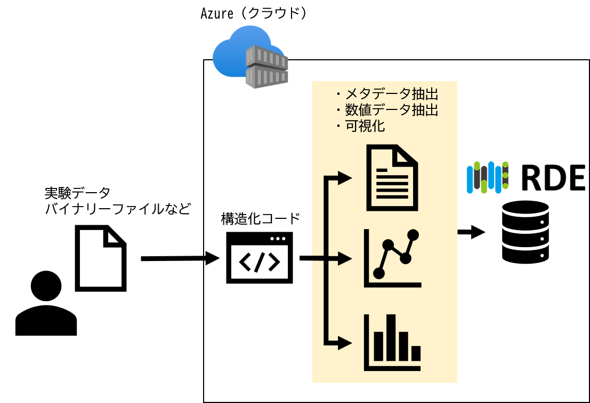
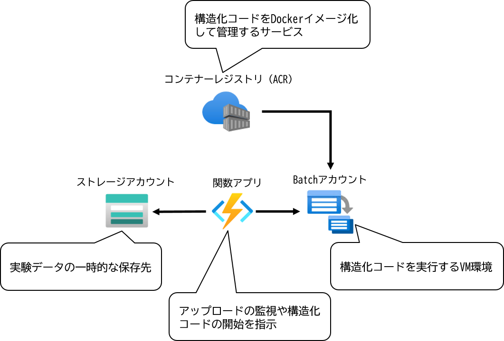

# はじめに

ようこそ、"RDE構造化プログラム開発"の世界へ!

本書は、RDE構造化プログラムの作成を実際にプログラムを作成しながら習得出来るようにするものです。

> 本書は、RDEToolKit(後述)の "バージョン1.3.4" に対応しています。

## RDEとは

RDEは、物質・材料についての研究データをオンラインで迅速に登録・活用するために国立研究開発法人 物質・材料研究機構(以下NIMS)が開発したシステムです。

装置からの出力ファイル(以下"生データ"または"生データファイル"と呼ぶ)をRDEのサイトにてアップロード、つまり"データ登録"を実行すると、自動的にデータ駆動型のマテリアル研究に適した形に構造化してクラウドに蓄積します。これによりユーザや研究グループ内での再利用や他の研究グループとのデータの共用が容易となり、マテリアル研究開発のDX化を支援します。

多くの場合、RDEへのデータ登録とは「データの永続化」、「データの構造化」、「計算処理」の3つの処理を実現するものです。この「データの永続化」、「データの構造化」、「計算処理」を実行するプログラムを「構造化プログラム」と呼び、上記3 種類の機能の一部または全てを実装します。

例えば、「データ永続化」のみを実施し、「データの構造化」や「計算処理」を全く処理しない「構造化プログラム」を開発することも可能です。

本書では、上記一連の処理を合わせて「RDE構造化処理」と呼ぶことにします。

> 本書の中で「構造化」という言葉は、メタデータ作成、CSVファイルの作成といった狭義の意味で使う場合と、RDE構造化処理全体の一連の処理といった広義の場合の2種類が混在しています。ご注意ください。

### データの永続化

実験により得た測定(RAW)ファイルなどを、RDEに登録する事で、削除や上書きされることなく保存しておくことができます。

RDE では登録されたファイルを"永続化ファイル"と呼びます。(決められた期間の後)保存された生データファイルを"非公開"とするか"公開"とするかは「構造化プログラム」の中で決定し処理が実行されます。

* RDEでは、保存するデータファイルとして実験データだけでなく、シミュレーション等の計算結果やパラメータファイルなども扱うこともできます。本書では、ここ以降「実験装置からの出力ファイル」に限定して進めることとします。
* 永続化ファイルは、RDE構造化処理の中で永続化対象フォルダに格納することで永続化ファイルとなります。ディレクトリ構成は後述します。

### データの構造化

RDEでは、登録するデータに

* 実験した日付
* 実験対象の試料種別
* 実験時の温度や圧力などの条件、特徴量

といった追加情報を付与することができます。このような情報を「メタデータ」と呼びます。

RDE における"データの構造化"は、以下のような処理が含まれます。

* 生データからメタデータを抽出し、JSON形式で保存する。
* 生データに含まれる計測値を、人が可読できるような数値データとしたデータファイル(CSV形式のファイルなど)を生成する。
* 生データに含まれる計測値をもとに、png形式やjpg形式のグラフ画像を生成する。

どのような項目をメタデータとして格納するのかは、構造化プログラム開発前に決定する必要があります。それぞれのメタデータに格納する値を、どのように取得するかは開発者が実装します。



### 計算処理

RDEにおける計算処理とは、「実験データなどを入力元として、何らかの計算等でデータを導出する処理」を指します。

例えば以下のようなものです。

* 実験データをGauss 分布等の数値モデルにフィッティングした結果のピーク位置を導出する。
* 実験データを統計的に集計した平均や標準偏差を導出する。

### RDEのシステム構成

RDEはクラウド上(MS Azure上)で動作します。データ構造化に関係するAzure のサービス連携図を示します。



構造化プログラムは最終的にDocker イメージ化されて、ACR(Azure Container Registry)に登録して利用します。

## 目的および対象読者

本書は、RDEにデータを投入するための構造化処理の開発に携わる方々(以下、"開発者"と呼ぶ)に向けて書かれています。

開発者は、NIMS職員のほか、NIMSまたは他の組織から委託された外部業者の場合もあり得ます。そのため本書では、開発者がいずれの立場であったとしても、問題無く構造化処理についてのプログラム作成が可能となるために必要な知識を提供することを目的とします。

また、本書では、RDE構造化処理を、Python言語で記述します。そのため開発者はPython言語についての一般的な知識を有していることが前提となります。

##  開発の流れ

RDEでの構造化処理の開発は、概ね以下の様になります。

1. ローカル開発
2. Dockerイメージ作成&確認
3. 上記Dockerイメージを基に、データセットテンプレート(後述)の作成
4. 作成されたテンプレートを基に、データセット(後述)の作成

本書では、これらのうち「ローカル開発」について記述します。

なお、ローカル開発にDockerコンテナを利用して行う方法もありますが、本書ではDockerコンテナを使用しない方式を想定します。

### ローカル開発とは?

RDEで構造化処理が行われるのは、クラウド上のLinux環境上です。ローカル開発とは、自前のLinux環境を用意し、その環境上で、想定されるデータがアップロードされた状態から、RDE構造化処理を実行し、想定されるファイル出力が行われるようにPythonスクリプト(あるいは他の開発言語)を生成することを指します。

構造化プログラムの開発言語は、Docker イメージを作成できれば任意のものに対応可能ですが、推奨している言語はPythonとなります。

本書はPython3.12 を使用して、シンプルな構造化プログラムをローカル環境で実装、 動作させます。

### データセットテンプレートとは

RDEにおいて、データセットテンプレート(あるいは単にテンプレートと呼ぶ場合もあります)とは、RDE構造化処理に必要な一連のスクリプトを含むDockerイメージのことを指します。

1つのデータセットは、必ず1つのテンプレートが指定され構成されます。

* 反対に複数のデータセットが、同じテンプレートを共用する場合もあります。

### データセットとは

登録画面の形式(項目や、その項目の形式、それぞれが必須かどうかの設定など)やどういった構造化処理を実施するかは、テンプレートにより確定します。

データセットは、1つのテンプレートを使って登録する一連のデータの集まり、または"器"です。データを登録するRDEユーザは、テンプレートではなく、データセットを選択して登録、つまりファイルをアップロードします。

テンプレートは、データセット開設時に決定し、以後変更されることはありません。つまり、同じデータセットに格納されたデータは、同じ構造化処理を実行したものであることが保証されることになります。

また、あるデータセットに対して想定されるデータとは異なる形式のデータを登録した場合はエラーとなって登録できないことになります。

### データタイルとは

前述のように、1つのデータセットには、同じ形式のデータが複数登録されます。

それぞれのデータ(ファイル、または複数のファイル群)を"データタイル"と呼びます。

* 1回のRDE構造化処理にて出来るのが"1つのデータタイル"とは限りません。1回のRDE構造化処理で複数のデータタイルを登録することが(→そのようにテンプレートを構成することが)可能です。

### インボイス(Invoice/送り状)とは

RDEでは、データを登録する際に、登録されるデータがどういう条件で実験や計測を行ったか、といった項目を、実験結果のファイルとは別に記述することができます。

この項目を記述したファイルをInvoice(またはInvoiceファイル)と呼びます。さらに別称として"送り状"と呼ぶ場合もあります。

Invoiceファイルは、画面入力をそのままJSON形式のファイルにして利用する場合の他、複数のInvoice情報をまとめて記述できるExcel形式ファイルの場合など複数のやり方があります。

> RDEではInvoiceの情報項目もメタデータとして利用されます。手入力のメタデータがある場合はInvoiceに定義します。

### Pythonのバージョン、外部ライブラリのバージョンの考え方

多くの場合、RDE構造化処理は、Python言語により開発されることが想定されます。

後述するRDEToolKitのバージョンに応じたPythonのバージョンをお使いください。

現時点(2025年09月)では、以下のバージョンをご利用ください。

* Python 3.12.x

> 特に問題がない場合は、Python3.12の中の最新版をお使いください。

RDEToolKitが利用する外部ライブラリは、RDEToolKitに付随するrequirements.txtに記述されていますので、RDEToolKitインストール時に、指定されたライブラリの、指定されたバージョンが同時にインストールされます。

その他必要な外部ライブラリの利用は任意ですが、それぞれのライブラリを`バージョンを指定`しての利用を考えてください。

> これは、例えば"1.1.3以上"と指定するのではなく"1.1.3"と固定で指定することを意味します。

### RDEToolKitとは

RDE構造化処理をサポートするツール群や、RDE構造化処理のワークフローを作成するツール群をまとめたもので、Pythonのpipパッケージとして提供されています。

RDEToolKitを使うことで、RDE構造化処理により出力されるファイルを格納するフォルダ構成の自動生成や、metadata-def.jsonファイルを用いたメタデータJSONファイルの簡易生成機能の提供など、開発者が構造化処理を構築する際の作業負荷軽減が可能となります。

RDEToolKitでは、以下の4つの処理モードを想定しています。

| \# | 処理モード | 説明 | 備考 |
|----|-------|----|----|
| 1 | Invoiceモード | 1つのInvoiceファイルを用い、1つのデータタイルを対象とした処理モード | ※本書はこれを想定 |
| 2 | ExcelInvoiceモード | Invoiceファイルの代わりにExcel形式でInvoice情報を与える処理モード |  |
| 3 | マルチデータタイルモード | 複数のファイルを、Invoiceなしで登録する処理モード |  |
| 4 | RDEフォーマットモード | 構造化処理を予め済ました状態で登録する処理モード |  |

> これら処理モードの名称は暫定的なものです。近い将来変更される可能性がありますので注意してください。

今後のRDE構造化処理の開発は、RDEToolKitを使用することが強く推奨されます。

<div class="page" />

## 結局のところ、RDE構造化処理プログラムはなにをすればいいんですか?

いままでの説明で、なんとなくはRDE構造化処理プログラムのイメージはつかんでいただけたかと思います。

ただ、こうも思っているかもしれません。

```
で、結局のところ、RDE構造化処理プログラムは何をすればいいのか?
```

具体的な処理については、後続の章に譲りますが、まとめると以下の様になります。

* 起動されたら、以下に示すような処理を実行する(通常は`python main.py`にて起動する)。
* 起動スクリプト(以下、"main.py"として記述します。)と同じ階層にある"data/inputdata"フォルダから入力ファイルを読み込む。zip圧縮されている場合は、展開してから読み込む。
* main.pyと同じ階層にある"data/invoice"フォルダにある"invoice.json"を読み込む。必要なら改変し、永続化フォルダ("data/nonshred_raw"または"data/raw"のいずれか)にコピーする。
* 入力ファイルを、永続化フォルダにコピーする。
* メタデータを収集し、main.pyと同じ階層にある"data/metadata"フォルダに、metadata.jsonとして出力する。
* 可読化など何らかの"解析処理"を実施し、main.pyと同じ階層にある"data/structured"フォルダに出力する。ファイル名、ファイル形式は任意。
* 入力ファイルに画像が含まれる場合はその画像を、main.pyと同じ階層にある"data/main_image"または"data/other_image"フォルダにコピーする。または可視化処理に伴いグラフ画像などの画像データが作成される場合は、main.pyと同じ階層にある"data/main_image"または"data/other_image"フォルダに出力する。ファイル名は任意ですが、現状ファイル形式には制限があります(GIF形式、JPEG形式またはPNG形式)。
  * SVG形式など、その他の画像形式には対応していません。格納することはできますが、プレビューが表示されない、ダウンロード出来なくなるなどの不具合が発生しますので注意してください。

これらの処理の一部、または全部を実行するようにスクリプトを作成すればよいことになります。
