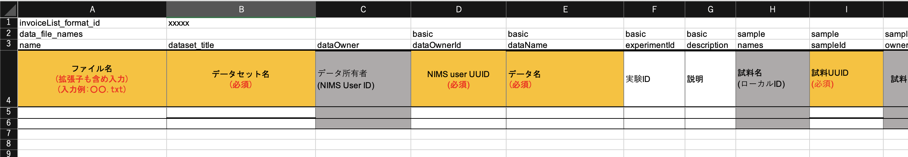

# はじめに

## 構造化処理の4つのモード

RDEにデータを登録する構造化処理には、以下に示すような4つの[モード](#mode)が存在します。

- インボイスモード
- エクセルインボイスモード
- マルチデータタイルモード
- RDEフォーマットモード

本ドキュメントでは、"モード"それぞれの概要と、利用方法について説明します。

| モード名 | 制御ファイル | 起動条件 |
| --- | --- | --- |
| インボイスモード | なし | デフォルトで起動 |
| エクセルインボイスモード | なし | 入力ファイルに`*._excel_invoice.xlsx`を格納 |
| マルチデータタイルモード | Config | `extended_mode="MultDataTile"`を指定し、データセットテンプレートを作成する。 |
| RDEフォーマットモード | Config | `extended_mode="rdeformat"`を指定し、データセットテンプレートを作成する。 |

* Configに指定する方法については、[後述](#config)します。

### <a id="mode" />モードとは何か?

モードは何で、どういった違いがあるでしょうか?

RDEToolKitを用いて作成した構造化処理プログラムを実行する際の初期段階において、入力ファイルをどのように展開するかの種別を"モード"と言います。

入力ファイルに合わせて適切なモードを設定して構造化処理プログラムを作成することにより、zip圧縮された入力ファイルを適切なディレクトリに展開したり、本来であれば複数回のアップロードが必要な登録作業を一度に実行するようになります。その結果、複数回の構造化処理が必要な場合には、適切に展開、配置されたそれぞれのデータフォルダに対して、構造化処理プログラムが実行されるようになります。

つまり、`入力ファイルの展開`や、`Excelファイルの内容を読み込み、invoice.jsonを生成する`などの処理を、開発者がそれぞれ実装する必要はなく、RDEToolKitに"任せる"ことでできるようになります。

以下、それぞれのモードについて、その概要を示します。

### インボイスモード

このモードは、通常のRDE登録画面でデータを登録するモードです。一番、基本的かつデフォルトのモードです。

以下のように、Entry画面から、データを投入するモードです。


### エクセルインボイスモード

このモードは、一度に複数のデータを登録するためのモードです。通常のインボイスモードでは一件ずつしかデータの登録が実行できませんが、エクセルインボイスモードを使うと、一度に複数のデータ(→複数のデータタイル)を登録することができます。

入力ファイルに、`*_excel_invoice.xlsx`という命名規則を持つExcelファイルが存在する場合、自動的にエクセルインボイスモードに移行し、Excelファイルの内容を使ってデータが登録されます。

> いくつかのテンプレートで、上記命名規則を持たないExcelファイルをエクセルインボイスとして利用するように実装しているものがあります。これはtasksupportフォルダに、excelinvoice_flag.txtというファイルが存在し、かつ、入力ファイルとしてエクセルファイルが登録された場合に、そのエクセルファイルのファイル名末尾を、`*_excel_invoice.xlsx`に変更することで実現しています。すなわち、構造化処理プログラムの開発者がそれらの処理を自前で実装する必要があることに注意してください。

インボイスとして利用するExcelファイルは、以下の場所にテンプレートファイルがあり、そちらをダウンロードし変更して利用します。

- [エクセルインボイステンプレート - rde-operation](https://gitlab.nims.go.jp/rde/rde-operation/-/tree/main/%E3%82%A8%E3%82%AF%E3%82%BB%E3%83%AB%E3%82%A4%E3%83%B3%E3%83%9C%E3%82%A4%E3%82%B9%E3%83%86%E3%83%B3%E3%83%97%E3%83%AC%E3%83%BC%E3%83%88?ref_type=heads)

> 上記サイトはNIMS内部からのみアクセスが可能であり、かつ有効なアカウントを保持しているユーザのみが利用可能です。他の環境で必要な場合は、関係者からファイルのコピーを受け取ってください。

エクセルインボイスとして構成したExcelファイルのフォーマット例を以下に示します。



RDEToolKit v1.1.0より、エクセルインボイスで利用するExcelファイルのひな形を生成する機能が提供されています。詳細は後述します。

### マルチデータタイルモード

マルチデータタイルモードは、一度のデータデータ受入(エントリー)で複数のデータを登録する処理をサポートするモードです。RDEのデータ一覧画面におけるデータの表示単位をデータタイルと呼ぶことがあります。複数のデータタイルを同時に登録できるという意味で「マルチデータタイル」モードとしています。

> 複数のファイルを1つのデータタイルに登録する場合は、"インボイスモード(またはエクセルインボイスモード)"を使います。

### RDEフォーマットモード

RDEフォーマットモードは、予めローカルPCなどで構造化処理処理を行い、その結果を構造化処理後のフォルダ構成(RDEフォーマット形式)でファイルを配置したファイル群をzipアーカイブしたものを登録するための機能を提供します。

入力データとして、以下のフォーマットを持つzip形式のファイルを投入する必要があります。

zipファイルの中に、invoice, main_image, other_image, structured、meta、raw、nonshared_raw、thumbnailといったフォルダがあり、その中にそれぞれのファイルを格納します。zipファイルは、登録前に構造化処理を実行し、そのファイルをそのまま格納します。

```text
|- sample.zip
    |- invoice/
    |   |- invoice.json
    |- main_image/
    |   |- xxxx.png
    |- meta/
    |   |- metadata.json
    |- nonshared_raw/
    |- other_image/
    |   |- xxxxx.png
    |- raw/
    |   |- xxxxxx.xxx
    |- structured/
    |   |- xxxxxxx.csv
    |- thumbnail/
    |   |- xxxx.png
```

通常のインボイスモードと同様のフォルダ構成の"シングルデータタイル"書き込みと、エクセルインボイスモードと同様のフォルダ構成の"マルチデータタイル"書き込みの2つのパターンがあり、どちらでも構造化処理プログラムを変更することなく利用可能です。

> RDETooKitを利用した構造化処理プログラムでは、RDEフォーマットモードとして取り込んだファイルに対してさらに
構造化処理を実行するようなプログラムを作成することも可能です。

<div class="page" />

## 使用するモードの選択基準

では、構造化処理プログラムを作成する際に、どのモードを利用すべきでしょうか?

以下の順に考慮して、使用するモードを選択してください。

### RDEサーバでの構造化処理が不要な場合

RDEフォーマットモードは、すでに手元のPCなどで構造化処理が済んでいる等の理由でRDE上で構造化処理を実行せず、そのままRDEデータセットに取り込むモードです。

サーバに取り込んだ後の構造化処理が不要の場合は、RDEフォーマットモードの利用を考えてください。

* 生データや画像などのデータを、RDEが想定しているフォルダに配置する処理も"構造化処理"に含まれます。配置をRDEに任せる場合は、RDEフォーマットモードは利用出来ません。他のモードを利用してください。

### 構造化処理の負荷が高い場合

構造化処理の負荷が高い場合、つまり構造化処理に時間がかかる場合も、できればローカルPCなどでの"前処理"を実行し、RDEフォーマットモードでの取り込みを考慮してください。

> こちらは運用上の"お願い"となります。他のユーザへの影響を考慮してのお願いです。

### 登録すべきデータが複数個存在

* 登録すべき過去の実験データが数百件以上ある、と言った場合です。

ファイル1つ毎にデータ(データタイル)として登録し、かつ、すべてのデータで同じ送り状の内容で良い場合は、マルチデータタイルモードを利用します。

> ただし、セットする値に入力ファイル名をそのままセットすればよい場合は、マジック変数(${filename})が利用できます。マジック変数については本書では扱いません。他のマニュアルを参照ください。

1つのデータタイルが単一ファイルで構成される場合で、送り状やメタデータをデータごとに変更して登録する場合は、エクセルインボイスモードを利用します。

複数のファイルを1つのデータタイルとして格納する場合で、送り状の内容をデータタイルごとに変更する場合も、エクセルインボイスモードを利用します。

### それ以外の場合

データ発生の都度、登録画面から登録することが可能な場合は、インボイスモードを利用します。

### インボイスモードとエクセルインボイスモードの同時利用

入力データとして、所定の命名規則に則ったExcelファイルが存在する場合はエクセルインボイスモードとしてデータを登録し、存在しない場合はインボイスモードとして登録する、という構造化処理を構成可能です。

通常は1つのデータセットに"2つのモード"のどちらを使っても登録することができます。ただし、以下の様な構造化処理プログラムを作成している場合は、修正が必要となります。

* 入力ファイルやインボイスファイルのパスの求め方を、Excelインボイスモード実行時にも対応できる書き方をしていない。
* `構造化処理プログラム内でExcelファイルを指定して情報を読み込む`など、Excelインボイスファイルの存在を前提として処理が書かれている。

## 本書の構成

次章以降は、以下の様に構成していきます。

最初に、すべてのモードに共通する処理をまとめて記述します。

続いて、「マルチデータタイルモード」について示します。

次にRDEフォーマットモードについて示します。

最後に、エクセルインボイスモードについて示します。エクセルインボイス内では最初に通常のインボイスモードについて示し、次に同じ環境を利用したエクセルインボイスモードについて示します。

> 通常の"インボイスモード"を独立した章とはしていませんの注意してください。
