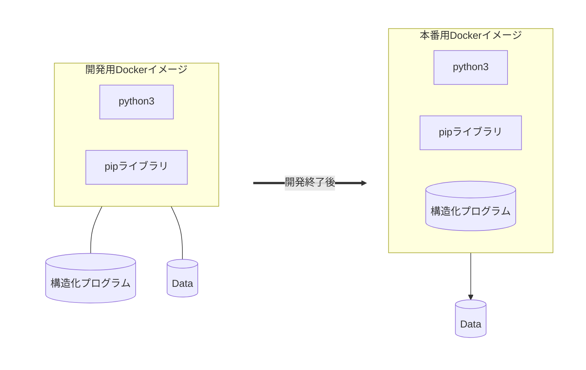

# はじめに

ようこそ、RDE構造化処理の開発の世界へ。

本書は、RDE構造化処理開発の一環としての、Dockerイメージ作成から、Dockerイメージを利用した開発方法までを解説します。

> RDE構造化処理は、主にPython言語を利用して構築されます。そのため本書ではPython言語を利用する形で記述します。

## 概要

RDEの構造化処理プログラムは、RDEシステム上ではDockerコンテナとして利用されます。そのため、どのような開発手法をとったとしても、最終的には、Dockerイメージを作成する必要があります。

多くの場合は、先にローカル環境(Windows,MacあるいはLinux等)上にPythonをインストールし、構造化処理プログラムを開発します。開発が完了した時点でそれを含めたDockerイメージを作成します。

一方で、ローカル環境にPython実行環境を導入できない、あるいは想定するPythonバージョンの用意が容易でないなどの場合は、開発のためのDockerイメージを作成し、それを利用して構造化処理プログラムを作成します。

DockerイメージをDockerコンテナとして起動し、その中にあるファイルを変更しても、Dockerコンテナを再起動した時点で元に戻ってしまいます。そのため、開発中は構造化処理プログラムをDockerイメージ外、つまりローカル環境側に置くなどの工夫が必要になります。開発したスクリプトは、Dockerイメージ外に置かれますので、Dockerコンテナの再起動の影響を受けずに保持されます。

> DockerにはDockerイメージ外に開発したスクリプトを保存する方法がいくつか存在しますが、本書では`バインドマウント`と呼ばれる方法を用いて、ローカル環境側のファイルシステムに保存します。そのため、ファイルの所有者や書き込み権限など気をつけなければいけない点もありますが、Docker外からスクリプトを変更することも可能です。

開発が終了し、テスト実行で問題がないことを確認した後、開発した構造化処理プログラムを含む形でDockerイメージを再作成します。このDockerイメージを使ったDockerコンテナを起動してテスト実行を行い、問題が無ければ開発終了です。

本書は、主に後者、つまりDockerを用いた方法での構造化処理プログラム開発の手順について解説します。

> 実際にRDE環境で利用するデータセットを構築するには、コンテナレジストリと呼ばれるサーバ上にDockerイメージをアップロードしたり、ソースコード一式を提出していただいたりする必要がありますが、それらの作業はについては本書の範囲外とします。詳細については別途問合せください。

Dockerを利用した開発処理のイメージを以下に示します。

稼働しているDockerイメージを`コンテナ`と言います。このコンテナ内でファイル(main.pyなど)を修正して(保存して)も、コンテナを停止した時点で変更内容は廃棄されて、次にDockerコンテナを起動した際には、Dockerイメージ作成時の状態で起動します。

開発した構造化処理プログラムを保存(→永続化)できるように、スクリプトとデータをDockerイメージ外に置いて、コンテナを起動し、そのコンテナ上で開発(Pythonスクリプト作成)を行います。

> 以後、コンテナ内の環境と区別するため、dockerを実行しているLinux等の環境を、`ローカル環境`と呼ぶことにします。

起動したコンテナ上で`main.py`を実行し、想定されたファイルが出力されるかを確認します。

スクリプトが異常終了したり、想定した結果ではないファイルが生成された場合は、コンテナ上で再びPythonスクリプトを修正します。

以降は、コンテナ上で`開発(修正) → 実行(確認) → 開発(修正) → 実行(確認) → ……`を繰り返します。

最終的には構造化処理プログラムのソースコードはDockerイメージに**含まれている**必要があります。開発が完了した(Pythonソースコードを修正する必要がなくなった)時点で、それらを組み込んだDockerイメージを実行用として再作成します。

このようにPythonスクリプトの開発と実行をコンテナ上で行いますので、ローカル環境上にはPython環境を用意する必要はありません。

## 対象読者

以下のような方々を対象とします。

* RDEToolKitを利用して構造化処理を開発する開発者
* 開発自体は他者(他社)に任せているが、最終的にRDE環境にDockerイメージとして登録する作業に携わる方

> 本書の利用にあたっては、ある程度の`Dockerに関する基礎知識`を有していることが必要となります。

## 注意

* 本書ではRDEToolKit v1.3.4を使った場合の例を表示しています。バージョンによっては動作が異なる可能性があります。
* 本書では、"フォルダ"と"ディレクトリ"を同じ意味で使用しています。

## 既知の問題(制約)

ファイル名(スクリプト名や、データファイル名)に日本語を使うことは可能ですが、文字コードの違い(UTF-8かシフトJISか)、その他の原因で正しく処理されない場合が考えられます。

ファイル名に日本語を含む名前を付けることはできる限り避けてください。

また、スクリプト内に日本語を書く場合は、文字コード`UTF-8`で記述してください。

> 構造化処理プログラム内で読み込む`データファイル`の中に含まれる日本語の取扱については、構造化処理プログラムをどのように記述するか次第となります。こちらは特に制限はありませんので、文字コード判別してから処理を行うなど、構造化処理プログラムの中で適切な記述を行ってください。

